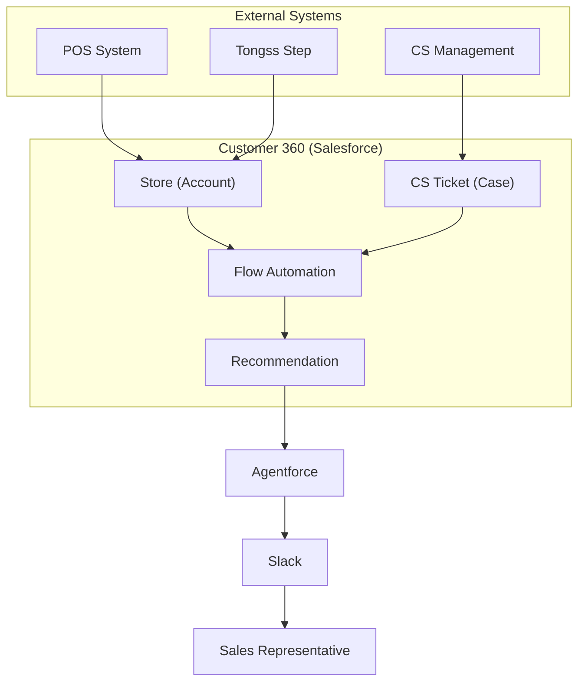

<table align="center">
<tr>
<td>

```text
   _--_     _--_    _--_     _--_     _--_     _--_     _--_     _--_
  (    )~~~(    )  (    )~~~(    )   (    )~~~(    )   (    )~~~(    )
   \           /    \           /     \           /     \           /
    (  ' _ `  )      (  ' _ `  )       (  ' _ `  )       (  ' _ `  )
     \       /        \       /         \       /         \       /
   .__( `-' )          ( `-' )           ( `-' )        .__( `-' )  ___
  / !  `---' \      _--'`---_          .--`---'\       /   /`---'`-'   \
 /  \         !    /         \___     /        _>\    /   /          ._/   __
!   /\        )   /   /       !  \   /  /-___-'   ) /'   /.-----\___/     /  )
!   !_\       ). (   <        !__/ /'  (        _/  \___//          `----'   !
 \    \       ! \ \   \      /\    \___/`------' )       \            ______/
  \___/   )  /__/  \--/   \ /  \  ._    \      `<         `--_____----'
    \    /   !       `.    )-   \/  ) ___>-_     \   /-\    \    /
    /   !   /         !   !  `.    / /      `-_   `-/  /    !   !
   !   /__ /___       /  /__   \__/ (  \---__/ `-_    /     /  /__
   (______)____)     (______)        \__)         `-_/     (______)
```

</td>
</tr>
</table>

# Cell — Salesforce Customer 360

> Customer 360 project for Tongss Place  
> Built with Salesforce, Agentforce, Flow, Apex, and Slack Integration.

---

## 📖 Overview

**Cell** is a Salesforce Customer 360 project for **Tongss Place**.

The goal is to help sales representatives identify high-potential stores by combining customer support history, POS usage, and operational insights into a single Salesforce Org.

Instead of making random cold calls, sales representatives receive AI-assisted recommendations every morning through Slack.

---

## ✨ Key Features

- Customer 360 Record Page
- Salesforce Flow Automation
- Agentforce Recommendation
- Slack Notification Integration
- POS Usage Analytics
- CS Ticket Management
- Sales Opportunity Management
- Tongss Step Summary

---

## 🏗️ Architecture



---

## 📂 Documentation

| Document | Description |
|----------|-------------|
| `00_PRODUCT_GUIDE.md` | Product vision and scope |
| `01_PERSONAS.md` | User personas |
| `02_USER_FLOW.md` | User journey |
| `03_PROJECT_GUIDE.md` | Team guide |
| `04_DATA_MODEL.md` | Business objects & fields |
| `05_SYSTEM_ARCHITECTURE.md` | System architecture |
| `06_OBJECT_ERD.md` | Object relationships |
| `07_PROCESS_DIAGRAM.md` | Business process |
| `08_SCREEN_SPEC.md` | Screen specification |
| `09_PROJECT_TREE.md` | Repository structure |
| `10_DECISIONS.md` | ADR & decision log |

---

## 🛠 Tech Stack

- Salesforce
- Agentforce
- Apex
- Flow
- Lightning App Builder
- Lightning Web Components (LWC)
- Slack API
- External Credential

---

## 👥 Contributors

| Name | Role |
|------|------|
| Sara | PM / Product Owner |
| 승우 | Salesforce Admin Lead |
| 은영 | Developer Lead |
| 혜준 | Platform & QA Lead |
| 아론 | Demo Lead |

---

## 📄 License

This project was created for educational and portfolio purposes.