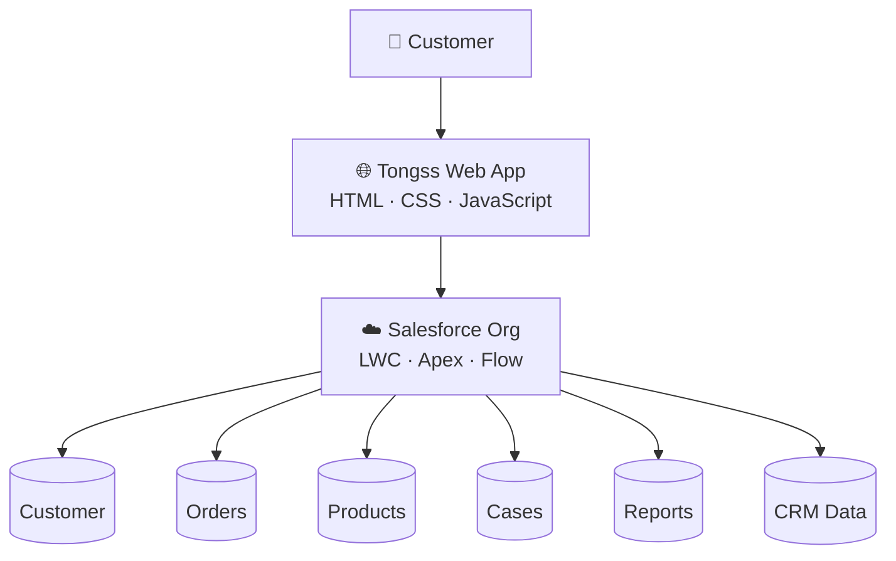

<table align="center"><tr><td>

```
   _--_     _--_    _--_     _--_     _--_     _--_     _--_     _--_
  (    )~~~(    )  (    )~~~(    )   (    )~~~(    )   (    )~~~(    )
   \           /    \           /     \           /     \           /
    (  ' _ `  )      (  ' _ `  )       (  ' _ `  )       (  ' _ `  )
     \       /        \       /         \       /         \       /
   .__( `-' )          ( `-' )           ( `-' )        .__( `-' )  ___
  / !  `---' \      _--'`---_          .--`---'\       /   /`---'`-'   \
 /  \         !    /         \___     /        _>\    /   /          ._/   __
!   /\        )   /   /       !  \   /  /-___-'   ) /'   /.-----\___/     /  )
!   !_\       ). (   <        !__/ /'  (        _/  \___//          `----'   !
 \    \       ! \ \   \      /\    \___/`------' )       \            ______/
  \___/   )  /__/  \--/   \ /  \  ._    \      `<         `--_____----'
    \    /   !       `.    )-   \/  ) ___>-_     \   /-\    \    /
    /   !   /         !   !  `.    / /      `-_   `-/  /    !   !
   !   /__ /___       /  /__   \__/ (  \---__/ `-_    /     /  /__
   (______)____)     (______)        \__)         `-_/     (______)

   
                                                      
```

</td></tr></table>

<p align="center">
  
  
  
  
  
  
</p>

# Project Tongss

Project Tongss is a Salesforce CRM project inspired by the T0$$ user experience.

It connects a modern customer-facing web application with Salesforce, allowing customer interactions to flow seamlessly into CRM. The project demonstrates how a frontend application and Salesforce can work together through a clean architecture focused on usability, maintainability, and scalability.

---

## Key Features

- 🏦 T0$$-inspired customer experience
- ☁️ Salesforce CRM integration
- 👤 Customer & Account management
- 📦 Product and Order management
- 📋 Case & Service workflows
- ⚡ Apex business logic
- 🧩 Lightning Web Components (LWC)
- 🎨 Shared Design System
- 🔗 Frontend ↔ Salesforce integration

---

##  Architecture



---

## Contributor


