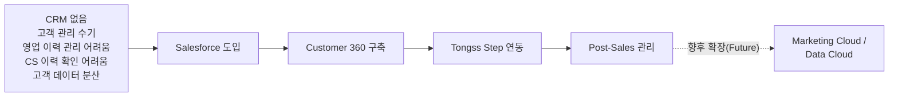
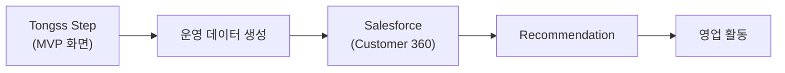

# 00_PRODUCT_GUIDE — Customer 360이 뭔지, 뭘 만드는지

> 이 문서 하나만 읽으면 "우리가 왜, 무엇을 만드는지" 다 알 수 있습니다.
> 팀명 Cell, 팀 배경, 오브젝트 매핑 등 기본 전제는 `CLAUDE.md`를 따릅니다 — 이 문서와 `CLAUDE.md`가 다르면 `CLAUDE.md`가 맞습니다.

---

## 1. 무슨 문제를 푸는가 — 한 줄 목표

> **을지로3가 POS 1,000개 매장 중 Step 도입은 10개뿐. CRM 없이 데이터가 흩어져 있어 나머지 990개 중 누구에게 가야 할지 몰라 무작위 콜드콜만 하던 박세일즈가, Customer 360 도입 후 아침에 Slack으로 오늘 연락할 리드 10개를 받는다 — 이 Before/After가 Demo Day의 전부다.**

Tongss Place는 **아직 CRM을 쓰지 않는다.** 영업 이력은 담당자 개인 메모장·엑셀에, CS 문의는 전화
상담 기록에, 매장 운영 현황은 또 다른 곳에 — 데이터가 회사 전체에 흩어져 있다. 그래서 어떤 매장이
CS 이슈를 반복적으로 겪고 있고 그것이 신사업(Tongss Step) 도입 신호인지, 영업팀은 알 방법이 없다.

**이 프로젝트의 핵심은 "Customer 360을 구축하는 프로젝트"다.** Salesforce를 신규 도입해 영업·CS·운영
데이터를 하나의 Org로 통합하고, CS에서 쌓이는 신호가 영업 기회로 자동 연결되게 만든다.

**Tongss Step 전체 앱(TongssApp)은 만들지 않는다.** Salesforce가 활용할 운영 데이터를 만들어내는
**MVP 화면만** 이번 프로젝트 범위에 포함한다 — §3.5, §4 참조.

---

## 2. Vision

> Tongss Place는 Salesforce를 기반으로 Customer 360을 구축하여
> 영업, 고객지원, 운영 데이터를 하나의 플랫폼에서 통합 관리한다.
>
> 궁극적으로는 Tongss Step에서 생성되는 운영 데이터를 활용하여
> AI 기반 고객 관리(Customer 360), 마케팅(Marketing Cloud),
> 데이터 분석(Data Cloud)으로 확장 가능한 CRM 플랫폼을 구축하는 것을 목표로 한다.

---

## 3. 우리가 만드는 것

### 3.1 배경

- Tongss Place: POS 37만 매장 보유(100만 목표), 신사업 Tongss Step(HR·운영 통합 SaaS)을 파일럿 중
- **현재 CRM 없음** — 영업/CS/운영 데이터가 시스템 없이 분산되어 있음
- 이 프로젝트에서 Salesforce(Customer 360)를 **신규 도입**해 하나의 Org로 통합 관리

### 3.2 세일즈 조직 규모

- Tongss Step Sales 조직 — 서울 영업본부 60명
- 그중 **중구·종로 담당팀 6명**, 1인당 담당 매장 약 1,300개

### 3.3 CS팀 역할 상세

가맹점의 **결제·단말기·정산 관련 문의와 장애**를 접수하고 해결·사후관리를 담당한다. 현재는 전담
시스템 없이 **전화 상담과 수기 기록**으로 처리한다. Customer 360 도입 후 아래 항목을 Case로
수집·관리한다.

- 문의 유형
- 상담 이력
- 처리 시간
- 장애 내역
- 고객 만족도

### 3.4 프로젝트 스토리

이번 프로젝트(MVP)는 **A → E까지**를 다룬다. F(Marketing/Data Cloud 확장)는 이번 범위가 아니다 — §4 참조.

### 3.5 Tongss Step의 역할 — "Summary만 주는 서비스"가 아니라 "운영 데이터를 만드는 MVP"

Tongss Step은 Tongss Place 고객(가맹점주)이 실제로 쓰는 운영 플랫폼(MVP)이다. 예시 기능: 체크리스트,
직원 관리, 교육 현황, 노무/세무 상담 신청, 운영 현황. **이번 프로젝트에서는 Tongss Step 전체를
구현하지 않는다.** "MVP 화면"만 제작해, Salesforce(Customer 360)가 활용할 운영 데이터를 생성하는
역할로 한정한다. MVP 화면은 **Sara가 직접 디자인·구현**한다 — §4.

이 구조에서 Tongss Step이 하는 일은 딱 하나 — **운영 데이터를 만들어 Customer 360으로 보내는 것**이다.
그 데이터를 근거로 "이 매장에 연락해야 한다"고 판단(Recommendation)하고 실제 영업으로 이어가는 것은
전부 Customer 360 쪽의 일이다 — 시스템 레벨 상세는 `05_SYSTEM_ARCHITECTURE.md` 참조.

### 3.6 장기 방향성

Customer 360이 안정화된 이후의 데이터 활용 방향은 §4의 Future Roadmap으로 정리했다 — 이 절에서
중복해서 다루지 않는다.

---

## 4. MVP Scope & Roadmap

### 4.1 MVP(이번 프로젝트 범위)

| 구성 요소 | 내용 | 담당 |
|---|---|---|
| Salesforce Customer 360 | Sales Cloud + Service Cloud(Case) 기반 통합 Org | 승우 |
| Flow Automation | 반복 조건 판정, Recommendation 생성 등 자동화 | 승우 |
| Recommendation | Flow가 생성하는 영업 추천 Object | 승우 |
| Slack Notification | Recommendation을 박세일즈에게 전달 | 은영 |
| Agentforce | Customer 360 데이터를 읽어 자연어 질의·추천 설명 | 승우, 은영 |
| **Tongss Step MVP 화면** | 체크리스트/직원 관리/교육 현황/노무·세무 상담 신청/운영 현황 중 **Salesforce가 활용할 운영 데이터를 만드는 최소 화면**. 전체 앱이 아니다 | **Sara** |

역할 상세는 `03_PROJECT_GUIDE.md` 참조. Object/Field 상세는 `04_DATA_MODEL.md`(유일한 진실).

### 4.2 Future Roadmap(이번 프로젝트 범위 아님)

| 방향 | 내용 |
|---|---|
| Data Cloud 연계 | 여러 소스의 고객 데이터를 통합·정제해 더 정교한 세그먼트/분석에 활용 |
| Marketing Cloud | 고객 맞춤형 마케팅 캠페인 설계·자동 발송 |
| 제안서 자동 생성(Agentforce) | 매장별 데이터를 근거로 영업 제안서를 AI가 초안 작성 |
| 전문가 CRM(세무사·노무사·컨설턴트 관리) | Tongss Step의 노무/세무 상담 신청 데이터를 실제 전문가 매칭·관리로 확장 |
| Tongss Step 고도화 | MVP 화면을 넘어 Tongss Step을 실제 서비스 수준의 HR·운영 통합 SaaS로 완성 |
| Tableau 연동 | 별도 BI 도구 연동 여부는 추후 결정. 이번 MVP는 Salesforce 표준 Report/Dashboard(`08_SCREEN_SPEC.md` §3·§4)로 충분히 커버한다 |

**MVP와 Future는 명확히 분리한다.** Future 항목은 Demo Day에서 "다음 단계 방향성"으로만 언급하고,
이번 프로젝트의 완료 기준(Definition of Done)에는 포함하지 않는다.

---

## 5. 스코프 — Epic 목록

| Epic | 내용 |
|---|---|
| 1 | Lead 발굴 및 우선순위 관리 |
| 2 | 고객 정보 통합 조회 (POS+CS+영업) |
| 3 | CS 기반 영업 기회 발굴 |
| 4 | 영업 활동 관리 |
| 5 | AI 기반 영업 지원 (Flow 기반 Recommendation 생성 + Agentforce 자연어 조회·추천 설명) |

페르소나별 페인포인트와의 연결은 `01_PERSONAS.md` 참조. 오브젝트 매핑은 `04_DATA_MODEL.md` 참조(유일한 진실).

---

## 6. 일정과 리스크

### 6.1 추진 일정 (Milestone)

> **일정의 Single Source of Truth는 `03_PROJECT_GUIDE.md` §7이다.** 이 문서에는 같은 일정표를
> 중복 작성하지 않는다 — Week별 목표·Deliverable·담당자·Mid Review·Demo Day는 전부 그 문서를 본다.
> 요약하면: Week 1~5(8/3~9/3), 중간점검 8/14, 결과물 제출 9/2, Demo Day 9/4.

### 6.2 리스크

| 리스크 | 대응 |
|---|---|
| Customer 360·Agentforce 등 신규 SF 솔루션에 대한 조직 이해·활용도 부족 | 단계별 사용자 교육·실습, 파일럿 운영 후 전사 확대 검토 |
| Recommendation(Flow 생성)과 Agentforce 설명의 신뢰성 부족 가능성 | 추천 근거를 함께 제공해 영업 사원이 이유를 이해하고 판단하도록 함 |
| CRM을 한 번도 써본 적 없는 조직에 신규 도입하는 데 따른 초기 저항 | Before/After를 명확히 보여주는 Demo, 익숙한 UI(리스트뷰·Slack 알림) 우선 적용 |

> 문서 최초 작성 시점이라 위 항목이 현재 리스크 목록의 전부입니다. 이후 리스크는 이 표에 계속 추가합니다.

---

## 7. 문서 지도

`CLAUDE.md`의 문서 구조(00~10)를 따릅니다. 자세한 목록과 각 문서의 역할은 `CLAUDE.md` 참조.

> Salesforce가 처음이라 "Object", "Flow", "Agentforce" 같은 말이 낯설다면, 이 프로젝트 문서 대부분이
> 각 문서 상단에 **"처음 보는 용어?"** 안내 박스를 두고 있다 — 특히 `04_DATA_MODEL.md`,
> `05_SYSTEM_ARCHITECTURE.md`, `06_OBJECT_ERD.md`, `09_PROJECT_TREE.md`부터 읽으면 도움이 된다.

---

## Related Documents

- [`01_PERSONAS.md`](./01_PERSONAS.md) — 이 프로젝트가 누구를 위한 것인지
- [`02_USER_FLOW.md`](./02_USER_FLOW.md) — 한 줄 목표의 Before/After를 하루 흐름으로 풀어놓은 버전
- [`03_PROJECT_GUIDE.md`](./03_PROJECT_GUIDE.md) — 팀 역할과 일정 (Tongss Step MVP 화면=Sara 포함)
- [`04_DATA_MODEL.md`](./04_DATA_MODEL.md) — Epic들이 다루는 실제 데이터(Object/Field)의 유일한 진실
- [`05_SYSTEM_ARCHITECTURE.md`](./05_SYSTEM_ARCHITECTURE.md) — Tongss Step MVP → Customer 360 데이터 흐름의 시스템 레벨 상세
- [`members/README.md`](./members/README.md) — 팀원 개인 작업 공간
