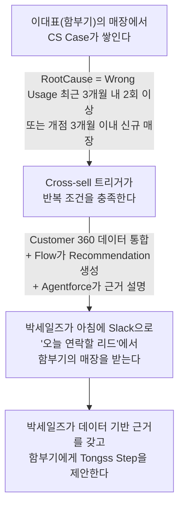

# 01_PERSONAS — 박세일즈, 이대표

> 이 프로젝트가 다루는 페르소나는 **박세일즈, 이대표(함부기) 둘뿐**입니다. 다른 인물(김스태프 등)은 등장하지 않습니다 — `CLAUDE.md` 참조.
> 기능을 만들다가 "이거 왜 이렇게 만들어요?"라는 질문이 생기면 이 문서로 돌아오세요.

---

## 이 둘은 하나의 흐름으로 연결됩니다

이 흐름이 끊기면 안 됩니다 — `00_PRODUCT_GUIDE.md`의 "한 줄 목표"와 같은 내용입니다.

---

## 박세일즈 — Tongss Place 영업 담당자

| 항목 | 내용 |
|---|---|
| 성별 / 나이 | 남성 / 31세 |
| 직책 | 영업 담당자 (Sales Manager) |
| 담당 지역 및 매장 | 서울 중구·종로구, 약 1,300개 |
| 근무시간 | 평일 9시~19시 |
| 의사결정 권한 | 담당 고객 관리 및 영업 전략 수립, 프로모션·솔루션 제안 |
| 디지털 숙련도 | CRM·모바일 업무 앱·태블릿에 익숙, 데이터 기반 고객 관리 업무에 익숙 |

**주요 역할**
- 신규 가맹점 영업
- 기존 고객 관리, 정기 방문
- 운영 컨설팅, 추가 서비스 제안
- Tongss Solution(Tongss Step 등) 신규 영업

**한 줄:** 담당 매장이 1,300개까지 늘어나 누구를 먼저 만나야 할지 스스로 판단하기 어려워진 영업 담당자.

**성향**
- 효율적으로 많은 고객을 관리하는 것을 중시
- 데이터 기반 맞춤 제안 선호
- 신뢰 관계 형성을 가장 중요한 영업 역량으로 여김

**최근 상황 (페인포인트)**
- 담당 매장이 1,300개까지 늘어나 전체 관리가 어려움
- 솔루션 도입 가능성이 높은 매장을 빠르게 찾지 못해 Lead 우선순위 설정에 어려움
- 데이터 기반으로 우선 방문할 고객을 추천받고 싶어함

**이 사람을 위해 지킬 것**
- 리드 추천은 "왜 이 매장인가"에 대한 근거(CS 이력, POS 사용 패턴 등)와 함께 제시되어야 한다 — 근거 없는 추천은 신뢰하지 않는다
- 익숙한 Salesforce 문법(리스트뷰, 레코드 페이지, Slack 알림) 그대로, 새로 학습할 UI를 최소화한다
- 1,300개 매장 전체가 아니라, "오늘 연락할 소수"로 좁혀서 보여준다

**성공의 정의:** 아침에 Slack을 열면 오늘 연락할 리드 10개가 이유와 함께 이미 정렬되어 있다.

---

## 이대표 (함부기) — Tongss Place 이용 자영업자

| 항목 | 내용 |
|---|---|
| 이름 | 함부기 |
| 성별 / 나이 | 남성 / 35세 |
| 직책 | 매장 대표이자 운영 책임자 |
| 근무시간 | 평일 하루 평균 14시간 |
| 의사결정 권한 | 결제기기·POS·매장 운영서비스 도입을 직접 결정 |
| 디지털 숙련도 | POS·배달앱·모바일뱅킹은 익숙하나, 복잡한 초기 설정·새 시스템 학습엔 부담을 느낌 |

**주요 역할**
- 매장 운영, 메뉴 개발, 발주
- 직원 교육, 고객 응대, 마케팅

**한 줄:** 신혼에 곧 아이가 태어나는데, 신입 직원이 POS기를 자주 고장내 손이 더 가는 자영업자.

**성향**
- 바쁜 업무를 빠르게 처리하는 것 선호
- 세세한 관리보다 직원을 믿고 맡기고 싶어함
- 사람을 좋아하고 직원과의 관계를 중시

**최근 상황 (페인포인트)**
- 신혼, 2개월 뒤 첫 아이 출산 예정 — 매장 운영과 가정 사이 시간 배분 고민이 커짐
- 신입 직원이 POS기를 자주 고장냄

> ⚠️ **이 페인포인트가 Cross-sell 트리거로 이어지는 지점**
> 함부기는 바쁜 업무 특성상 신입 직원 교육에 충분한 시간을 쓰지 못하고, 그 결과 신입 직원이 POS기를 반복해서 잘못 조작한다. 이 반복된 오조작은 CS Case로 접수되며, RootCause가 "Wrong Usage"로 최근 3개월 내 2회 이상 쌓이면 Cross-sell 트리거 조건을 충족한다(`CLAUDE.md` 참조). 즉 함부기의 개인적 상황(출산 준비로 바빠 직원 교육에 소홀해짐)이 매장의 반복적 CS 이슈로 나타나고, 이것이 데이터로 쌓여 박세일즈에게 "이 매장은 Tongss Step(직원 교육·운영 통합) 도입이 필요하다"는 리드로 전달되는 구조다.

**이 사람을 위해 지킬 것**
- 새 시스템(Tongss Step) 제안은 "설정이 복잡하지 않다"는 확신을 먼저 줘야 한다 — 시간이 없는 사람이다
- 박세일즈가 먼저 데이터를 보고 필요한 시점에 다가오는 방식이어야 한다 — 함부기가 먼저 문제를 찾아 나설 여유는 없다
- 직원에게 맡기고 싶어하는 성향을 고려해, 솔루션은 "함부기가 매번 확인하지 않아도 되는" 방향으로 제안한다

**성공의 정의:** 바쁜 와중에도 박세일즈가 먼저 "요즘 직원분들 POS 다루기 힘드시죠?"라고 정확한 타이밍에 연락해주고, 그 제안이 실제 문제(신입 직원 오조작)를 해결해준다.

---

## 이 문서를 쓸 때 기억할 것

- 페르소나별로 페인포인트는 핵심만 다룹니다. 다른 페인포인트가 떠오르면 "지금 안 다룬다"로 남겨두고, 필요하면 `10_DECISIONS.md`에 왜 뺐는지 기록하세요.
- 두 페르소나 외 인물(김스태프 등)을 새로 등장시키지 않습니다.

---

## Related Documents

- [`00_PRODUCT_GUIDE.md`](./00_PRODUCT_GUIDE.md) — 이 페르소나가 왜 중요한지(한 줄 목표)
- [`02_USER_FLOW.md`](./02_USER_FLOW.md) — 박세일즈의 하루를 시간 순서로 풀어놓은 버전
- [`04_DATA_MODEL.md`](./04_DATA_MODEL.md) — CS Case, Recommendation 등 여기 나온 데이터의 정의
- [`data/SAMPLE_DATA.md`](./data/SAMPLE_DATA.md) — 함부기 매장을 실제 데이터로 재현한 예시
