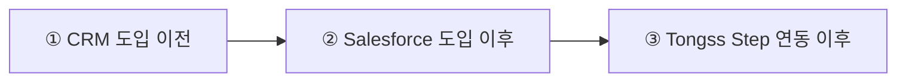
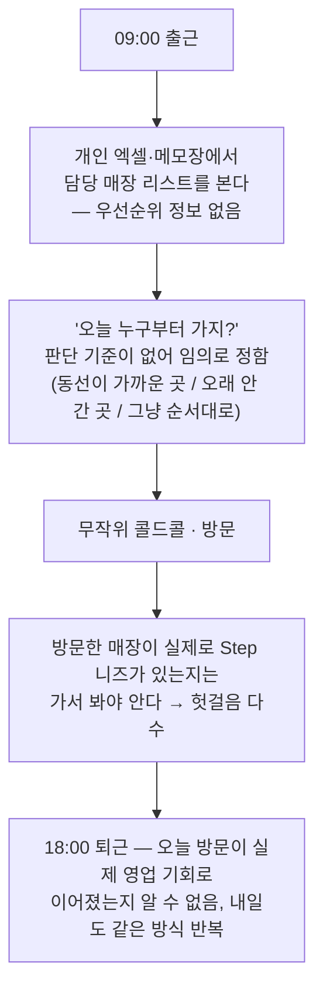
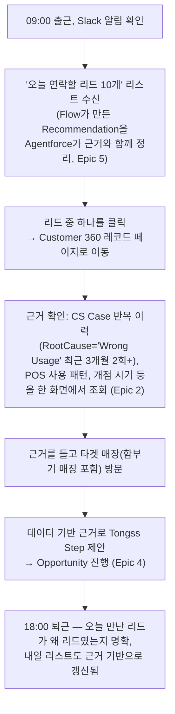
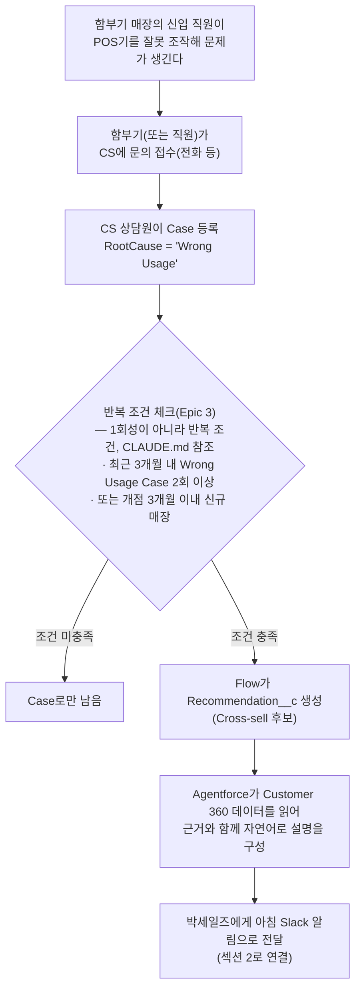
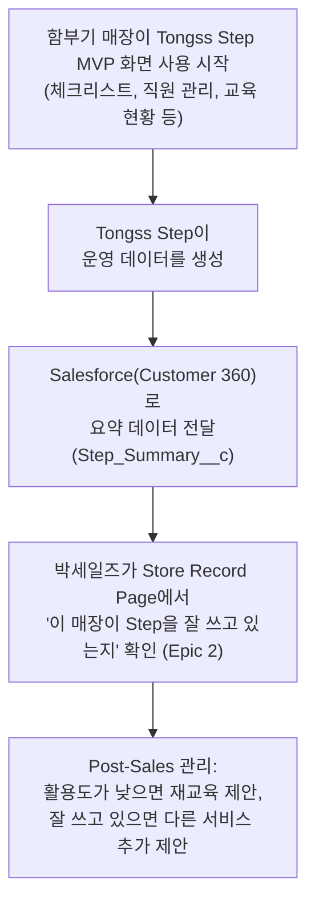

# 02_USER_FLOW — 박세일즈의 하루 (CRM 도입 이전 → Salesforce 도입 이후 → Tongss Step 연동 이후)

> 이 문서는 `00_PRODUCT_GUIDE.md`의 "한 줄 목표"와 `01_PERSONAS.md`의 인과관계 흐름을
> 시간 순서(하루 일과)로 풀어놓은 것입니다. 페르소나는 박세일즈, 이대표(함부기) 둘뿐 — `CLAUDE.md` 참조.
> 오브젝트 이름(Account/Case/Opportunity 등)은 `04_DATA_MODEL.md`가 유일한 진실입니다.

> **처음 보는 용어?**
>
> | 용어 | 설명 |
> |---|---|
> | Case | Salesforce 표준 Object. 고객 문의/장애 접수 1건 — 이 문서에서는 "CS Case"라고도 부른다. |
> | Opportunity | Salesforce 표준 Object. 영업 활동 1건(이 프로젝트에서는 "Sales Activity"라고 부른다) — 리드가 실제 영업으로 전환되면 생긴다. |
> | Record | Object의 데이터 한 건. 예: 매장 하나 = Account Record 하나. |

이 문서는 세 단계로 구성된다 — `00_PRODUCT_GUIDE.md` §3.4의 프로젝트 스토리와 같은 흐름이다.

---

## 1. CRM 도입 이전 — 지금의 박세일즈

박세일즈는 중구·종로구 약 **1,300개 매장**을 담당한다. **회사에 CRM이 없어서** 담당 매장 정보와
상담 이력을 개인 엑셀·메모장으로 관리하고, CS 문의 내역은 전화로 따로 물어보지 않는 한 알 수 없다
— `01_PERSONAS.md` 참조. 어떤 매장이 Tongss Step 도입 가능성이 높은지 알 방법이 없다.

**문제의 핵심:** CS가 "이 매장 POS 오조작으로 문의가 반복된다"는 것을 전화로 파악하고 있어도, 그
정보를 기록·공유할 시스템이 없으니 영업팀에게 넘어가지 않는다. 박세일즈는 이대표(함부기)의 매장이
Step 도입 신호를 보내고 있다는 사실을 알 방법이 없다.

---

## 2. Salesforce 도입 이후 — Customer 360으로 일하는 박세일즈

**바뀐 것:** 엑셀·메모장이 아니라 Customer 360 하나로 일한다. 1,300개 전체를 보는 게 아니라, CS
신호로 좁혀진 소수(10개)만 본다. 그리고 그 10개는 항상 "왜 이 매장인가"라는 근거를 달고 온다 —
`01_PERSONAS.md`의 "이 사람을 위해 지킬 것" 참조.

---

## 3. 이대표(함부기) 쪽 흐름 — CS Case에서 Recommendation까지

박세일즈의 "Salesforce 도입 이후"가 가능한 이유는, 그 이전에 CS 쪽에서 아래 흐름이 먼저 돌아가고
있기 때문이다.

> Opportunity는 이 시점에 자동 생성되지 않는다. 박세일즈가 Recommendation을 보고 실제 영업을 시작할 때
> 생성된다 — `04_DATA_MODEL.md` §8(Object Ownership), `07_PROCESS_DIAGRAM.md` 참조.

**반드시 지킬 것:** 반복 조건 충족 여부 판단과 Recommendation 생성은 CS Case 등록 시점에
자동으로 처리되어야 한다 — 박세일즈나 CS 상담원이 수동으로 "이 정도면 영업팀에 넘겨야겠다"고
판단하는 단계가 있으면 안 된다. 사람의 판단이 끼어드는 순간 "아침에 이미 준비된 리드"가 깨진다.

---

## 4. Tongss Step 연동 이후 — Post-Sales까지 이어지는 흐름

박세일즈가 함부기에게 Tongss Step을 제안해 도입시켰다면(섹션 2), 이야기는 여기서 끝나지 않는다.
함부기 매장이 Tongss Step MVP 화면(체크리스트·직원 관리·교육 현황 등 — `00_PRODUCT_GUIDE.md` §3.5)을
실제로 쓰기 시작하면서, 그 운영 데이터가 다시 Customer 360으로 들어온다.

**바뀐 것:** 영업은 계약(Opportunity Closed Won)에서 끝나지 않는다. Tongss Step이 실제로 잘 쓰이고
있는지가 Customer 360에 계속 쌓이고, 그 데이터가 다음 대화의 근거가 된다 — 이것이
`00_PRODUCT_GUIDE.md`의 Vision이 말하는 "영업·고객지원·운영 데이터의 통합 관리"가 실제 하루 업무에서
어떻게 보이는지다.

> Step_Summary__c의 Field(LearningRate, ChecklistRate, ActiveUsers 등)는 `04_DATA_MODEL.md` §5.5가
> 유일한 진실이다. 이 섹션은 그 데이터가 언제, 왜 쓰이는지를 스토리로 설명할 뿐 새 Field를 만들지 않는다.

---

## 5. 이 문서를 쓸 때 기억할 것

- 이 문서는 항상 박세일즈 1인 기준이다. 다른 영업 담당자 시나리오를 새로 만들지 않는다.
- 함부기 쪽 흐름(§3)은 "Case 등록 → 반복 조건 → Recommendation 자동 생성"까지만 다룬다(Opportunity가
  아니다). Recommendation 이후 실제 영업 대화 내용은 `01_PERSONAS.md`의 "성공의 정의"를 넘어서는
  디테일이므로 여기서 다루지 않는다.
- §4(Tongss Step 연동 이후)는 Post-Sales 단계의 "흐름"만 설명한다. Tongss Step MVP 화면 자체의 상세
  설계는 이 문서가 아니라 Sara가 별도로 관리한다 — `00_PRODUCT_GUIDE.md` §4.1 참조.
- 화면/기능 단위 스펙이 필요해지면 이 문서가 아니라 `08_SCREEN_SPEC.md`에서 다룬다.

---

## Related Documents

- [`00_PRODUCT_GUIDE.md`](./00_PRODUCT_GUIDE.md) — 이 하루 흐름이 왜 중요한지(한 줄 목표, Vision, 프로젝트 스토리)
- [`01_PERSONAS.md`](./01_PERSONAS.md) — 박세일즈·함부기 페르소나 상세
- [`05_SYSTEM_ARCHITECTURE.md`](./05_SYSTEM_ARCHITECTURE.md) — Flow/Agentforce/Slack이 시스템적으로 어떻게 연결되는지
- [`07_PROCESS_DIAGRAM.md`](./07_PROCESS_DIAGRAM.md) — §3의 자동화를 Flow 단계별로 상세히 본 버전
- [`08_SCREEN_SPEC.md`](./08_SCREEN_SPEC.md) — 이 흐름에서 박세일즈가 실제로 보는 화면
