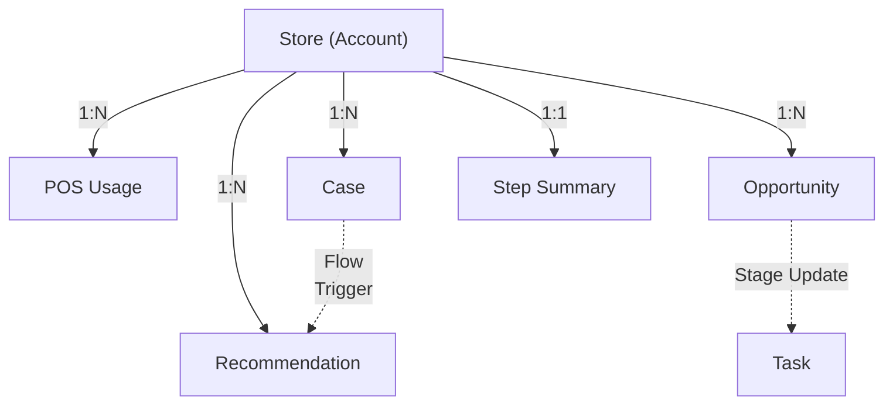

# 04_DATA_MODEL — 데이터 모델 (Single Source of Truth)

> 이 문서는 Cell 프로젝트의 **Object/Field에 대한 유일한 진실**입니다. 코드·Org 실제 구성과 이 문서가
> 다르면 이 문서가 맞다고 보고 코드/Org를 되돌립니다 — `CLAUDE.md` 작업 규칙 참조.
> 여기 없는 오브젝트/필드를 임의로 만들지 않습니다.
>
> 왜 이 데이터가 필요한지는 `00_PRODUCT_GUIDE.md`, 누구를 위한 것인지는 `01_PERSONAS.md`,
> 데이터가 실제로 언제 어떻게 만들어지는지는 `02_USER_FLOW.md`·`07_PROCESS_DIAGRAM.md`,
> 이 데이터가 어떤 화면에 나타나는지는 `08_SCREEN_SPEC.md`를 참조합니다.

> **처음 보는 용어?** 이 문서는 Salesforce 용어가 가장 많이 나오는 문서다. 미리 정리했다.
>
> | 용어 | 설명 |
> |---|---|
> | Object | 데이터를 저장하는 표(테이블)에 해당하는 Salesforce 용어. Account처럼 Salesforce가 기본 제공하는 **Standard Object**와, 우리가 새로 만드는 **Custom Object**(이름 끝에 `__c`가 붙는다)가 있다. |
> | Field | Object 안의 열(컬럼) 하나. 예: Account Object의 `Name` Field. |
> | Record | Object의 데이터 한 건 — 표의 "행" 하나. |
> | Lookup | 한 Record가 다른 Record를 가리키는 관계 필드(다른 시스템의 외래 키(FK)와 같은 개념). |
> | Picklist | 미리 정해둔 값 중에서만 고르는 선택형 Field(드롭다운). |
> | Upsert | Update(있으면 갱신) + Insert(없으면 새로 생성)를 합친 말. 같은 레코드를 중복 생성하지 않고 최신 상태만 유지할 때 쓴다. |

---

## 1. Business Domain

Cell이 다루는 도메인은 크게 세 축이다.

- **Store 운영 데이터** — Tongss Place 가맹점(Store)이 POS로 무엇을 파는지, 얼마나 파는지 (POS Usage)
- **CS 데이터** — Store가 겪는 문제와 그 원인 (CS Ticket)
- **Sales 데이터** — Store에 대한 영업 활동과 결과 (Sales Activity), 그리고 그 활동을 만들어내는
  판단 근거(Recommendation)와 신사업(Tongss Step) 도입 현황(Step Summary)

Tongss Place는 지금까지 이 세 축을 관리할 CRM이 없었다 — Sales는 개인 엑셀·메모장, CS는 전화 상담
기록, Tongss Step의 운영 데이터는 아직 Salesforce와 연결되지 않은 상태로 각자 흩어져 있었다
(`00_PRODUCT_GUIDE.md` §1). Customer 360의 데이터 모델은 이 세 축을 **Store(Account) 하나를 중심으로**
묶어, "이 매장이 지금 어떤 상태인가"를 한 화면에서 볼 수 있게 만드는 것이 목적이다.

**프로젝트 철학과 데이터 모델의 관계:**

- **Customer 360 중심** — 모든 커스텀 오브젝트는 Store(Account)를 Lookup으로 가진다. Store 없이 존재하는 데이터는 없다.
- **Declarative First / Standard Object 우선** — 표준 오브젝트(Account/Case/Opportunity)로 표현 가능한 것은
  절대 새 오브젝트를 만들지 않는다. §4, §6 참조.
- **Tongss Step MVP는 우리가 만들지만, Summary만 들어온다** — Tongss Step MVP(체크리스트·직원 관리·교육
  현황 등, Sara 구현 — `00_PRODUCT_GUIDE.md` §3.5)는 Salesforce Org 밖의 별도 앱이다. 우리가 직접 만드는
  앱이라도 그 내부 동작(체크리스트 항목별 상세, 학습 콘텐츠 진행률 등)까지 Salesforce로 보내지 않고,
  결과 요약(Step Summary)만 보내도록 **의도적으로** 설계했다. 이 원칙 때문에 Step Summary는 필드 수가
  적고 전부 "요약값"이다 — §5.5 참조.

---

## 2. Domain Model

- **Store 1 : N POS Usage** — 매장은 매일 POS 사용 기록을 쌓는다(`UsageDate` 기준 1건/일).
- **Store 1 : N CS Ticket** — 매장은 여러 번 CS에 문의할 수 있다.
- **Store 1 : N Sales Activity** — 매장에 대한 영업 활동은 여러 차례, 여러 Stage로 존재할 수 있다.
- **Store 1 : N Recommendation** — 반복 조건은 여러 번 충족될 수 있고, 그때마다 새 추천이 쌓인다(이전
  추천의 Status와 무관하게 새로 생성 — §5.6).
- **Store 1 : 1 Step Summary** — Tongss Step 앱의 현재 활용 상태는 "지금 어떤가"만 의미가 있으므로,
  매장당 최신 요약 1건만 유지한다(동기화 시 upsert). 이력이 필요해지면 이 결정을 `10_DECISIONS.md`에
  기록하고 1:N으로 바꾼다.
- **Sales Activity 1 : N Task(Follow-up)** — 방문 후 후속 조치는 표준 Task로 표현한다. Task는 Business
  Object가 아니라 Supporting Standard Object다(§6 참조).

---

## 3. Business Object 설명

| Business Object | 한 줄 설명 | Salesforce 오브젝트 |
|---|---|---|
| Store | Tongss Place 가맹점(매장) 1곳 | Account (표준) |
| POS Usage | 매장의 일별 POS 매출·사용 지표 | `POS_Usage__c` (커스텀) |
| CS Ticket | 매장이 접수한 CS 문의/장애 1건 | Case (표준) |
| Sales Activity | 매장에 대한 영업 활동 1건(Lead 발굴~Closed) | Opportunity (표준) |
| Step Summary | 매장의 Tongss Step MVP 활용 현황 요약(별도 앱에서 Summary만 수신) | `Step_Summary__c` (커스텀) |
| Recommendation | "이 매장에 지금 연락해야 하는 이유"를 담은 추천 1건 | `Recommendation__c` (커스텀) |

> 이 6개가 `CLAUDE.md`의 Business Object 매핑 표와 1:1로 대응하는 전부다. `07_PROCESS_DIAGRAM.md`의
> "Sales Visit → Opportunity Update → Follow-up 생성" 프로세스에 등장하는 **Follow-up(Task)은 이
> 6개에 포함되지 않는다** — Business Object가 아니라 Supporting Standard Object다. 정의는 §6 참조.

---

## 4. Standard Object Mapping

| Business Object | Salesforce Object | 표준/커스텀 | 비고 |
|---|---|---|---|
| Store | `Account` | 표준 | 확장 필드만 추가, 오브젝트 자체는 그대로 사용 |
| CS Ticket | `Case` | 표준 | `Store`는 Case 표준 필드 `AccountId`로 이미 존재 |
| Sales Activity | `Opportunity` | 표준 | `Store`는 Opportunity 표준 필드 `AccountId`로 이미 존재, `Stage`는 `StageName` 표준 필드의 값만 커스터마이즈 |
| POS Usage | `POS_Usage__c` | 커스텀 | 표준 오브젝트로 표현 불가(일별 시계열 지표) |
| Step Summary | `Step_Summary__c` | 커스텀 | Tongss Step MVP(별도 앱) 요약 저장용, 표준 오브젝트 없음 |
| Recommendation | `Recommendation__c` | 커스텀 | Salesforce에 이 개념에 대응하는 표준 오브젝트 없음(Lead와도 다름 — Store는 이미 Account로 존재하므로 Lead 전환이 아니라 "기존 Account에 대한 추천"임) |

> 이 표는 `CLAUDE.md`의 Business Object 매핑 표와 동일한 6개만 다룬다. Task(Follow-up)는 Business
> Object가 아니라 Supporting Standard Object이므로 이 표에 포함하지 않는다 — §6 참조.

**왜 새 커스텀 오브젝트가 3개뿐인가:** Account/Case/Opportunity는 각각 Store/CS Ticket/Sales Activity의
개념을 그대로 담을 수 있어 확장 필드만으로 충분하다. POS Usage(일별 시계열), Step Summary(외부 시스템
요약), Recommendation(Cross-sell 판단 결과)은 표준 오브젝트가 표현하는 개념과 다르므로 커스텀 오브젝트가
필요하다 — `CLAUDE.md` 오브젝트 매핑 표와 동일한 결론.

---

## 5. Custom Object 정의 및 Object별 Field

각 오브젝트 정의 순서: Business Object 개념 → API Name → 필드 표(Field API Name / Label / Type / 표준·커스텀
/ 필수 / Picklist 값 / 설명).

### 5.1 Store (`Account`, 표준)

가맹점 1곳. Region은 페르소나가 담당하는 중구·종로구를 포함한 서울 지역 구분이다(`01_PERSONAS.md` 참조).

| Field API Name | Label | Type | 표준/커스텀 | 필수 | Picklist 값 | 설명 |
|---|---|---|---|---|---|---|
| `Id` | Store ID (System) | ID | 표준 | - | - | Salesforce Record Id. Business의 "StoreID"는 이 시스템 Id를 의미 |
| `Store_External_Id__c` | External Store ID | Text(18), External ID, Unique | 커스텀 | Y | - | Tongss Place 자체 매장 마스터의 원본 ID. 더미/실 데이터 Import 시 upsert 키 |
| `Name` | Store Name | Text(255) | 표준 | Y | - | Business의 "StoreName" |
| `Industry` | Industry | Picklist | 표준 | N | 카페, 편의점, 식당, 미용, 기타 | 표준 Account 필드 재사용, 값만 Tongss Place 업종에 맞게 커스터마이즈 |
| `Region__c` | Region | Picklist | 커스텀 | Y | 중구, 종로구, 기타 | 담당 영업 조직 구분(`01_PERSONAS.md` — 박세일즈 담당: 중구·종로구) |
| `Opened_Date__c` | Opened Date | Date | 커스텀 | Y | - | 개점일. "개점 3개월 이내 신규 매장" Cross-sell 트리거 판정에 사용(`CLAUDE.md`) |
| `POS_Plan__c` | POS Plan | Picklist | 커스텀 | N | Basic, Standard, Premium | 매장이 쓰는 POS 요금제. 구체적 티어명은 영업정책 확정 전 임시값 — Sara 확인 필요 |
| `NumberOfEmployees` | Employee Count | Number | 표준 | N | - | 표준 Account 필드 재사용. "직원 수가 많음"은 Recommendation Reason("Many Employees")의 판단 근거 |
| `Step_Status__c` | Step Status | Picklist | 커스텀 | Y (기본값 Not Adopted) | Not Adopted, Adopted | Tongss Step 도입 여부. `00_PRODUCT_GUIDE.md`의 "1,300개 중 도입 매장" 구분에 대응 |

### 5.2 POS Usage (`POS_Usage__c`, 커스텀)

매장의 일별 POS 지표. 1 Store : N POS Usage(1건/일).

| Field API Name | Label | Type | 필수 | Picklist 값 | 설명 |
|---|---|---|---|---|---|
| `Store__c` | Store | Lookup(Account) | Y | - | 소속 매장 |
| `Usage_Date__c` | Usage Date | Date | Y | - | 집계 기준일 |
| `Daily_Sales__c` | Daily Sales | Currency(16,2) | N | - | 해당일 매출 |
| `Monthly_Sales__c` | Monthly Sales | Currency(16,2) | N | - | 해당일 기준 당월 누적 매출(외부 POS 시스템이 계산해 보내는 값, Salesforce에서 재계산하지 않음) |
| `Order_Count__c` | Order Count | Number(8,0) | N | - | 해당일 주문 건수 |
| `Refund_Count__c` | Refund Count | Number(8,0) | N | - | 해당일 환불 건수 |
| `Last_POS_Login__c` | Last POS Login | DateTime | N | - | 마지막 POS 로그인 시각 |
| `POS_Version__c` | POS Version | Text(20) | N | - | 단말기/앱 버전 |

### 5.3 CS Ticket (`Case`, 표준)

매장이 접수한 CS 문의/장애 1건. `RootCause__c`가 Cross-sell 트리거의 핵심 필드다.

| Field API Name | Label | Type | 표준/커스텀 | 필수 | Picklist 값 | 설명 |
|---|---|---|---|---|---|---|
| `AccountId` | Store | Lookup(Account) | 표준 | Y | - | Case 표준 필드 재사용. Business의 "Store" |
| `Type` | Category | Picklist | 표준 | N | 결제, 단말기, 정산, 기타 | 표준 Case 필드 재사용, Business의 "Category" |
| `Status` | Status | Picklist | 표준 | Y | New, In Progress, Closed | 표준 Case 필드 그대로 사용 |
| `Priority` | Priority | Picklist | 표준 | N | Low, Medium, High | 표준 Case 필드 그대로 사용 |
| `CreatedDate` | Created Date | DateTime | 표준(시스템) | - | - | 자동 생성, 반복 조건 판정의 "최근 3개월" 기준 |
| `Engineer_Visited__c` | Engineer Visited | Checkbox | 커스텀 | N (기본값 false) | - | 엔지니어 출동 여부 |
| `RootCause__c` | Root Cause | Picklist | 커스텀 | Y | Wrong Usage, POS Bug, Network, Hardware | **Cross-sell 트리거 핵심 필드.** "Wrong Usage" 반복 여부를 Flow가 체크(`CLAUDE.md`, `07_PROCESS_DIAGRAM.md`) |
| `OwnerId` | Owner | Lookup(User) | 표준 | Y | - | 표준 Case 필드 재사용. CS 상담원 |

> `Category`/`RootCause`를 표준 `Reason` 필드 하나로 합치지 않고 분리한 이유: `RootCause__c`는 Cross-sell
> 트리거가 직접 필터링하는 필드라, 다른 목적(문의 분류)과 값이 섞이면 트리거 조건이 깨지기 쉽다.

### 5.4 Sales Activity (`Opportunity`, 표준)

매장에 대한 영업 활동 1건. 새 커스텀 필드가 없다 — 표준 필드 재사용 + `StageName` 값 커스터마이즈만으로 충분.

| Field API Name | Label | Type | 표준/커스텀 | 필수 | Picklist 값 | 설명 |
|---|---|---|---|---|---|---|
| `AccountId` | Store | Lookup(Account) | 표준 | Y | - | Business의 "Store" |
| `OwnerId` | Owner | Lookup(User) | 표준 | Y | - | 담당 영업 담당자(박세일즈 역할) |
| `StageName` | Stage | Picklist | 표준(값 커스터마이즈) | Y | Prospecting, Call, Visit, Demo, Trial, Closed Won, Closed Lost | 기본 Opportunity Stage 값을 이 프로젝트의 세일즈 퍼널에 맞게 교체 |
| `CreatedDate` | Created Date | DateTime | 표준(시스템) | - | - | 자동 생성 |

### 5.5 Step Summary (`Step_Summary__c`, 커스텀)

Tongss Step MVP(Salesforce Org 밖의 별도 앱, Sara 구현 — `00_PRODUCT_GUIDE.md` §3.5)에서 넘어오는
요약값만 담는다 — "Summary만 들어온다" 원칙(§1). 매장당 최신 1건.

| Field API Name | Label | Type | 필수 | 설명 |
|---|---|---|---|---|
| `Store__c` | Store | Lookup(Account) | Y | 소속 매장 |
| `Learning_Rate__c` | Learning Rate | Percent(5,2) | N | 직원 교육 콘텐츠 학습 완료율 |
| `Checklist_Rate__c` | Checklist Rate | Percent(5,2) | N | 운영 체크리스트 완료율 |
| `Active_Users__c` | Active Users | Number(5,0) | N | Step 앱 활성 사용자 수 |
| `Last_Sync_Date__c` | Last Sync Date | DateTime | Y | Tongss Step MVP와 마지막 동기화 시각 |

> 이 오브젝트에 없는 필드(체크리스트 항목별 상세, 학습 콘텐츠별 진행률 등)는 Tongss Step MVP 안에만
> 남기고 Salesforce로 보내지 않는다 — 우리가 그 앱을 직접 만들더라도 의도적으로 이렇게 설계했다("Summary만
> 들어온다" 원칙, §1). Tongss Step MVP 자체의 화면·기능 설계는 이 문서가 아니라 `00_PRODUCT_GUIDE.md`
> §3.5·§4.1, 담당은 `members/00_SARA.md` 참조.

### 5.6 Recommendation (`Recommendation__c`, 커스텀)

"이 매장에 지금 연락해야 하는 이유"를 담은 추천 1건. 1 Store : N — 조건이 다시 충족되면 새 레코드가 또 생긴다(과거 추천을 덮어쓰지 않음. 이유는 §2 참조).

| Field API Name | Label | Type | 필수 | Picklist 값 | 설명 |
|---|---|---|---|---|---|
| `Store__c` | Store | Lookup(Account) | Y | - | 소속 매장 |
| `Reason__c` | Reason | Picklist | Y | Wrong Usage, New Store, High Sales, Many Employees | 추천이 발생한 근거. `Wrong Usage`/`New Store`는 `CLAUDE.md`의 반복 조건, `High Sales`/`Many Employees`는 매장 특성 기반 근거 |
| `Action__c` | Action | Picklist | Y | Call, Visit, Email | 권장 접촉 방식 |
| `Status__c` | Status | Picklist | Y (기본값 Pending) | Pending, Accepted, Dismissed | 박세일즈가 이 추천을 어떻게 처리했는지 |
| `CreatedDate` | Created Date | DateTime | 표준(시스템) | - | 자동 생성. 우선순위 정렬의 기준(최신순)으로도 쓰인다 — `08_SCREEN_SPEC.md` §2 |
| `OwnerId` | Owner | Lookup(User) | 표준 | - | 표준 필드 재사용 — 이 추천이 전달된 영업 담당자(박세일즈 역할). Slack 알림 대상 결정에 사용 |

> **Score__c는 MVP 범위에 없다.** 우선순위 점수를 계산하는 별도 로직 대신, Recommendation 우선순위는
> Wrong Usage 반복 건수(Reports의 "Wrong Usage Repeat Stores" — `08_SCREEN_SPEC.md` §4)와 `CreatedDate`
> 최신순만으로 판단한다. Score 같은 계산형 우선순위가 필요해지면 Future Scope로 다시 검토한다
> (`10_DECISIONS.md`).

---

## 6. Supporting Standard Objects

§3~§5가 다룬 6개는 `CLAUDE.md`의 Business Object 매핑 표와 1:1로 대응하는 **Business Object**다.
이 섹션이 다루는 오브젝트는 그와 성격이 다르다 — Cell의 도메인 개념(Store/POS Usage/CS Ticket/Sales
Activity/Step Summary/Recommendation) 중 하나에 대응하는 게 아니라, 그 개념들을 실행하는 과정에서
Salesforce가 표준으로 이미 제공하는 범용 오브젝트를 그대로 가져다 쓰는 경우다. 그래서 이 오브젝트는
`CLAUDE.md`의 Business Object 매핑 표에는 올리지 않는다 — 새 Business Object가 아니라 기존 Business
Object(Opportunity)를 보조하는 표준 오브젝트이기 때문이다. 결정 배경은 `10_DECISIONS.md` 참조.

### 6.1 Follow-up (`Task`, 표준 — Supporting)

영업 방문 후 후속 조치. Sales Activity(Opportunity)에 딸린 보조 데이터이며 그 자체로 독립적인
Business Object가 아니다 — `06_OBJECT_ERD.md`에서도 Account를 직접 참조하지 않고 Opportunity를
거쳐서만 연결된다. 새 필드 없음 — 표준 Task 필드만 사용.

| Field API Name | Label | Type | 설명 |
|---|---|---|---|
| `WhatId` | Related To | Lookup(Opportunity) | 표준 필드 재사용, 어떤 Sales Activity의 후속 조치인지 |
| `OwnerId` | Assigned To | Lookup(User) | 표준 필드 재사용 |
| `ActivityDate` | Due Date | Date | 표준 필드 재사용 |
| `Status` | Status | Picklist | 표준 필드 그대로 사용(Not Started/In Progress/Completed) |

생성 시점과 자동화 주체는 `07_PROCESS_DIAGRAM.md` §3(Sales Visit → Opportunity Update → Follow-up 생성) 참조.

---

## 7. Data Dictionary (전체 요약)

### 7.1 Business Object

| Object | 신규 커스텀 필드 수 | 재사용 표준 필드 | Store 연결 방식 |
|---|---|---|---|
| Account (Store) | 4 (`Region__c`, `Opened_Date__c`, `POS_Plan__c`, `Step_Status__c`) + 1 External ID | `Name`, `Industry`, `NumberOfEmployees` | 자기 자신(중심 오브젝트) |
| `POS_Usage__c` | 7(전체 커스텀) | - | `Store__c` (Lookup) |
| Case (CS Ticket) | 2 (`Engineer_Visited__c`, `RootCause__c`) | `AccountId`, `Type`, `Status`, `Priority`, `OwnerId`, `CreatedDate` | `AccountId` (표준 Lookup) |
| Opportunity (Sales Activity) | 0 | `AccountId`, `OwnerId`, `StageName`, `CreatedDate` | `AccountId` (표준 Lookup) |
| `Step_Summary__c` | 4(전체 커스텀) | - | `Store__c` (Lookup) |
| `Recommendation__c` | 3(전체 커스텀) | `OwnerId`, `CreatedDate` | `Store__c` (Lookup) |

**신규 커스텀 오브젝트는 3개(`POS_Usage__c`, `Step_Summary__c`, `Recommendation__c`), 총 신규 커스텀 필드는
Account 4개 + Case 2개 + 커스텀 오브젝트 14개 = 20개**다. 이 숫자가 늘어나면 먼저 이 문서를 고치고
`10_DECISIONS.md`에 왜 늘었는지 남긴다.

### 7.2 Supporting Standard Object

| Object | 신규 커스텀 필드 수 | 재사용 표준 필드 | Store 연결 방식 |
|---|---|---|---|
| Task (Follow-up) | 0 | `WhatId`, `OwnerId`, `ActivityDate`, `Status` | `WhatId` → Opportunity → `AccountId` (2-hop, §6.1) |

Business Object 집계(위 20개)에는 포함하지 않는다 — Task는 새 스키마가 아니라 표준 오브젝트를 그대로
쓰는 것이기 때문이다.

---

## 8. Object Ownership

"누가 이 오브젝트의 스키마를 관리하고, 누가 이 오브젝트의 데이터를 만드는가"는 다르다. 역할 정의는
`03_PROJECT_GUIDE.md` §1 참조. Business Object(§3)와 Supporting Standard Object(§6)를 구분 없이 함께
정리한다 — 운영 관점에서는 둘 다 "누가 책임지는가"를 알아야 하기 때문이다.

| Object | 구분 | 스키마 Owner (Object/Field 설계·생성) | 데이터 Owner (레코드가 어떻게 생기는가) |
|---|---|---|---|
| Account (Store) | Business Object | 승우 (Admin Lead) | 아론이 Dummy Data로 최초 적재, 이후 실제 운영 시 Tongss Place 매장 마스터 연동 |
| `POS_Usage__c` | Business Object | 승우 (Admin Lead) | 외부 POS 시스템 Inbound(Import) — `05_SYSTEM_ARCHITECTURE.md` |
| Case (CS Ticket) | Business Object | 승우 (Admin Lead) | CS 상담원이 Salesforce에서 직접 생성(더 이상 별도 CS 시스템 아님) |
| Opportunity (Sales Activity) | Business Object | 승우 (Admin Lead) | 박세일즈 역할 사용자가 **항상 직접** 생성/갱신 — Flow는 Opportunity를 생성하지 않는다(Recommendation을 검토한 뒤 수동 생성) |
| `Step_Summary__c` | Business Object | 승우 (Admin Lead), 연동은 은영 (Developer Lead) | Tongss Step MVP(Sara 구현)에서 생성된 운영 데이터를 은영이 REST API로 수신해 upsert — `05_SYSTEM_ARCHITECTURE.md` §3.3 |
| `Recommendation__c` | Business Object | 승우 (Admin Lead) | Flow(반복 조건 충족 시 자동 생성) — `07_PROCESS_DIAGRAM.md`. Agentforce는 생성하지 않고 읽기만 한다 — `05_SYSTEM_ARCHITECTURE.md` §3.5 |
| Task (Follow-up) | Supporting Standard Object | 승우 (Admin Lead) | Flow(Opportunity Stage 변경 시 자동 생성) |

QA(혜준)는 모든 오브젝트의 Permission Set·Reports/Dashboard를 관리하지만 스키마 Owner는 아니다 —
`03_PROJECT_GUIDE.md` §2 참조.

---

## 9. Salesforce Mapping (필드 레벨 총괄표)

Business 용어로만 대화할 때 실제 Salesforce API 이름을 찾기 위한 총괄 인덱스. 상세 설명은 §5 각 절 참조.

| Business 용어 | Salesforce Object.Field |
|---|---|
| Store.StoreID | `Account.Id` (시스템) / `Account.Store_External_Id__c` (외부 연동 키) |
| Store.StoreName | `Account.Name` |
| Store.Industry | `Account.Industry` |
| Store.Region | `Account.Region__c` |
| Store.OpenedDate | `Account.Opened_Date__c` |
| Store.POSPlan | `Account.POS_Plan__c` |
| Store.EmployeeCount | `Account.NumberOfEmployees` |
| Store.StepStatus | `Account.Step_Status__c` |
| POS Usage.Store | `POS_Usage__c.Store__c` |
| POS Usage.UsageDate | `POS_Usage__c.Usage_Date__c` |
| POS Usage.DailySales | `POS_Usage__c.Daily_Sales__c` |
| POS Usage.MonthlySales | `POS_Usage__c.Monthly_Sales__c` |
| POS Usage.OrderCount | `POS_Usage__c.Order_Count__c` |
| POS Usage.RefundCount | `POS_Usage__c.Refund_Count__c` |
| POS Usage.LastPOSLogin | `POS_Usage__c.Last_POS_Login__c` |
| POS Usage.POSVersion | `POS_Usage__c.POS_Version__c` |
| CS Ticket.Store | `Case.AccountId` |
| CS Ticket.Category | `Case.Type` |
| CS Ticket.Status | `Case.Status` |
| CS Ticket.Priority | `Case.Priority` |
| CS Ticket.CreatedDate | `Case.CreatedDate` |
| CS Ticket.EngineerVisited | `Case.Engineer_Visited__c` |
| CS Ticket.RootCause | `Case.RootCause__c` |
| CS Ticket.Owner | `Case.OwnerId` |
| Sales Activity.Store | `Opportunity.AccountId` |
| Sales Activity.Owner | `Opportunity.OwnerId` |
| Sales Activity.Stage | `Opportunity.StageName` |
| Sales Activity.CreatedDate | `Opportunity.CreatedDate` |
| Step Summary.Store | `Step_Summary__c.Store__c` |
| Step Summary.LearningRate | `Step_Summary__c.Learning_Rate__c` |
| Step Summary.ChecklistRate | `Step_Summary__c.Checklist_Rate__c` |
| Step Summary.ActiveUsers | `Step_Summary__c.Active_Users__c` |
| Step Summary.LastSyncDate | `Step_Summary__c.Last_Sync_Date__c` |
| Recommendation.Store | `Recommendation__c.Store__c` |
| Recommendation.Reason | `Recommendation__c.Reason__c` |
| Recommendation.Action | `Recommendation__c.Action__c` |
| Recommendation.Status | `Recommendation__c.Status__c` |
| Recommendation.CreatedDate | `Recommendation__c.CreatedDate` |

**Supporting Standard Object**

| Business 용어 | Salesforce Object.Field |
|---|---|
| Follow-up | `Task` (WhatId/OwnerId/ActivityDate/Status 표준 필드, §6.1) |

---

## 10. 이 문서를 쓸 때 기억할 것

- 오브젝트/필드를 추가·변경하려면 먼저 이 문서를 고치고, 그다음 Org/코드를 고친다 — 반대 순서로 하지 않는다.
- 새 커스텀 오브젝트가 필요해 보이면, 먼저 표준 오브젝트로 표현할 수 없는지 확인한다(§6 Follow-up=Task가 그 예).
  단, 새로 확인된 Supporting Standard Object를 `CLAUDE.md`의 Business Object 매핑 표에 추가하지는 않는다 —
  Business Object가 아니기 때문이다. §6 도입부 참조.
- Picklist 값에 "확정 필요" 표시가 있는 필드(`POS_Plan__c` 등)는 임의로 값을 늘리거나 바꾸지 않고 Sara에게 확인한다.
- 이 문서와 `06_OBJECT_ERD.md`는 같은 관계를 다른 각도(비즈니스 의미 vs 정형 ERD)로 설명한다 — 관계 자체가
  바뀌면 두 문서를 함께 고친다.

---

## Related Documents

- [`06_OBJECT_ERD.md`](./06_OBJECT_ERD.md) — 같은 Object들을 관계(ERD) 중심으로 본 버전
- [`05_SYSTEM_ARCHITECTURE.md`](./05_SYSTEM_ARCHITECTURE.md) — 이 Object들이 시스템 안에서 어떻게 움직이는지
- [`07_PROCESS_DIAGRAM.md`](./07_PROCESS_DIAGRAM.md) — Record가 실제로 언제, 어떤 자동화로 생성되는지
- [`08_SCREEN_SPEC.md`](./08_SCREEN_SPEC.md) — 이 Object들이 어떤 화면에 나타나는지
- [`09_PROJECT_TREE.md`](./09_PROJECT_TREE.md) — 이 Object들이 Metadata로 저장되는 폴더 구조
- [`data/SAMPLE_DATA.md`](./data/SAMPLE_DATA.md) — 이 Object들의 실제 예시 데이터
