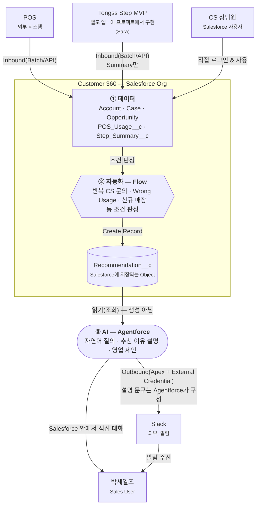

# 05_SYSTEM_ARCHITECTURE — 시스템 구성

> 이 문서는 "데이터가 어디서 오고 어디로 가는가"를 다룹니다. Object/Field 자체는 `04_DATA_MODEL.md`(유일한
> 진실), Object 간 관계는 `06_OBJECT_ERD.md`, 자동화의 상세 단계는 `07_PROCESS_DIAGRAM.md`를 참조합니다.
> Tongss Step MVP는 이 프로젝트에서 Sara가 구현하지만(`00_PRODUCT_GUIDE.md` §3.5), 그 화면·기능 자체의
> 상세 설계는 이 문서가 아니라 `00_PRODUCT_GUIDE.md`가 다룹니다 — 이 문서는 "Salesforce가 그 앱으로부터
> 무엇을 받는가"까지만 다룹니다.

> **처음 보는 용어?** 이 문서에는 Salesforce 용어가 자주 나옵니다. 미리 정리했습니다.
>
> | 용어 | 설명 |
> |---|---|
> | Salesforce Org | 우리 팀이 쓰는 Salesforce "회사 전체 공간" 하나. Customer 360 프로젝트가 만드는 결과물이 바로 이 Org 안에 들어간다. |
> | Object | 데이터를 저장하는 표(테이블)에 해당하는 Salesforce 용어. Account, Case처럼 Salesforce가 기본 제공하는 **표준(Standard) Object**와, 우리가 새로 만드는 **커스텀(Custom) Object**(예: `Recommendation__c`)가 있다. |
> | Flow | 코드를 쓰지 않고 화면에서 조건·자동화 로직을 만드는 Salesforce 도구. "이 조건이면 이 레코드를 만들어라" 같은 로직을 개발자 없이 구성한다. |
> | Apex | Salesforce의 프로그래밍 언어(코드). Flow로 표현하기 어려운 로직(외부 시스템 호출 등)에만 제한적으로 쓴다 — §5. |
> | External Credential | 외부 서비스(Slack 등)에 접속할 때 필요한 인증 정보(토큰 등)를 Salesforce 안에 안전하게 저장해두는 기능. |
> | Agentforce | Salesforce 안에서 동작하는 AI 에이전트 기능. 저장된 데이터를 읽어서 자연어로 답하거나 설명해준다. |

---

## 1. 전체 시스템 구성

Cell이 다루는 시스템은 6개다. 이 중 **Customer 360(Salesforce Org)이 중심**이고, 나머지 5개는 여기로
데이터를 보내거나(Inbound), 여기서 데이터를 받는(Outbound) 주변 시스템이다.

| 시스템 | 성격 | Customer 360과의 관계 |
|---|---|---|
| POS | 외부 — Tongss Place 매장의 결제 단말기/POS 시스템 | Inbound만 (POS Usage 전송) |
| CS | **이 프로젝트로 Salesforce에 흡수됨** — 더 이상 별도 시스템 아님 | 없음(§3 참조 — CS 상담원이 Salesforce를 직접 사용) |
| Tongss Step MVP | Salesforce Org 밖의 별도 앱 — **이 프로젝트에서 구현**(담당 Sara, `00_PRODUCT_GUIDE.md` §3.5·§4.1) | Inbound만, **Summary만** (Step Summary 전송) |
| Slack | 외부 — 팀/개인 알림 채널 | Outbound만 (Recommendation 알림 전송) |
| Agentforce | Salesforce Org 내부 기능(외부 시스템 아님) | Customer 360 + `Recommendation__c` 데이터를 **읽어서** 자연어 질의/추천 설명/영업 지원 수행. `Recommendation__c`를 생성하지 않는다 — §2, §3.5 |
| Customer 360 | **중심** — Salesforce Org (Account/Case/Opportunity + 커스텀 3종) | - |

---

## 2. 시스템 아키텍처 다이어그램 — 데이터 → 자동화 → AI

Salesforce의 세 계층(데이터/자동화/AI)이 각각 무슨 역할인지를 명확히 분리한 것이 이 프로젝트 아키텍처의
핵심이다. **Flow가 `Recommendation__c`를 생성하고, Agentforce는 이미 만들어진 데이터를 읽기만 한다** —
Agentforce가 Recommendation을 만드는 것이 아니다.

> Slack으로 나가는 실제 HTTP 전송은 Agentforce가 아니라 Apex + External Credential이 처리한다(§3.4).
> 위 다이어그램의 "Agentforce → Slack" 화살표는 **그 메시지에 들어갈 자연어 설명을 Agentforce가
> 구성한다**는 뜻이지, Agentforce가 직접 외부로 콜아웃을 보낸다는 뜻이 아니다.

### 2.1 컴포넌트별 책임

발표에서 "이 박스는 뭘 하는 박스인가"를 설명할 때 이 표를 그대로 쓸 수 있다.

| 컴포넌트 | 책임 | 책임이 아닌 것 |
|---|---|---|
| Customer 360 Data | Account/Case/Opportunity/`POS_Usage__c`/`Step_Summary__c`에 데이터를 보관 | 조건 판정, 추천 생성, 설명 생성 |
| Flow | 반복 CS 문의·Wrong Usage·신규 매장 등 조건을 판정하고 `Recommendation__c`를 생성 | 자연어 설명, 대화형 질의 응답 |
| `Recommendation__c` | Flow가 만든 추천 결과를 담는 Salesforce Object(Score/Reason/Action/Status) | AI가 실시간으로 만들어내는 응답이 아님 — 저장된 레코드 |
| Agentforce | Customer 360 + `Recommendation__c`를 읽어 자연어 질의 응답·추천 이유 설명·영업 제안 수행 | `Recommendation__c` 생성, 반복 조건 판정 |
| Slack / Sales User | Agentforce가 구성한 설명을 전달받거나(Slack), Salesforce 안에서 Agentforce와 직접 대화(Sales User) | - |

---

## 3. 외부 시스템과 Salesforce의 관계

### 3.1 POS — Inbound만

- **보내는 데이터:** 매장별 일별 POS 지표(`POS_Usage__c`) — `04_DATA_MODEL.md` §5.2
- **주기:** 배치(일 1회, 전일자 마감 지표 기준). 실시간 연동은 이 프로젝트 범위 밖.
- **데모 범위:** 실제 POS 연동 대신 아론(Demo Lead)이 만든 Dummy Data를 Data Import Wizard/CLI로 적재
  (`03_PROJECT_GUIDE.md` §3.2, `09_PROJECT_TREE.md` §4, `data/SAMPLE_DATA.md`). 실제 연동 스펙(API/인증)은
  이 프로젝트 범위에서 확정하지 않는다 — 확정 필요 시 Sara에게 확인.

### 3.2 CS — 별도 시스템이 아니라 Salesforce로 흡수됨

`CLAUDE.md`가 말하는 이 프로젝트의 핵심이 여기다: "Tongss Place는 아직 CRM을 쓰지 않는다 — 영업·CS·
운영 데이터가 여러 곳에 흩어져 있다. Salesforce(Customer 360)를 신규 도입해 하나의 Org로 통합한다."
즉 CS는 Customer 360에 데이터를 보내는 **외부 시스템이 아니라**, 애초에 전담 시스템이 없던 업무이고
(`00_PRODUCT_GUIDE.md` §3.3), 프로젝트 완료 후에는 CS 상담원이 Salesforce에 **직접 로그인해서 Case를
생성·처리하는 사용자**가 된다.

- Inbound 연동 없음, Outbound 연동 없음
- 인증: Salesforce 표준 로그인(사용자 계정), CS 상담원용 Permission Set(사용자가 어떤 데이터에 접근할
  수 있는지 정하는 권한 묶음)은 혜준(Platform/QA Lead) 담당
- 기존 CS 시스템의 과거 데이터를 이관해야 한다면 이는 별도의 1회성 Data Migration이며, 상시 Integration
  Point가 아니다 — 필요 여부는 Sara 확인 후 `10_DECISIONS.md`에 기록

### 3.3 Tongss Step MVP — Inbound만, Summary만 (우리가 만들지만 원칙은 그대로)

- **보내는 데이터:** `Step_Summary__c` 뿐 (`04_DATA_MODEL.md` §5.5) — LearningRate, ChecklistRate,
  ActiveUsers, LastSyncDate. 체크리스트 개별 항목, 학습 콘텐츠 상세 등 원본 데이터는 넘어오지 않는다.
- **주기:** 배치(REST API), 매장당 최신 요약을 upsert(같은 매장 레코드가 있으면 갱신, 없으면 새로 생성
  — 1:1, `04_DATA_MODEL.md` §2)
- **왜 Summary만인가:** Tongss Step MVP는 이 프로젝트에서 우리가 직접 만드는 앱이지만(Sara 담당,
  `00_PRODUCT_GUIDE.md` §3.5), Salesforce Org와는 별개의 앱으로 남긴다. Salesforce는 그 앱의 운영
  방식을 알 필요가 없고, "이 매장이 Step을 얼마나 잘 쓰고 있는가"라는 결과만 필요하다는 원칙은 우리가
  직접 만들더라도 그대로 유지한다 — 이 원칙을 지켜야 Customer 360의 스키마가 Tongss Step MVP 화면이
  바뀔 때마다 함께 흔들리지 않는다.
- **인증/API 상세:** Tongss Step MVP → Salesforce REST API 연동은 은영(Developer Lead)이 구현한다
  (`members/02_EUNYOUNG.md`). 구체적 인증 방식(토큰 등)은 이 문서에서 미리 확정하지 않는다 — 구현
  시점에 은영·승우가 정하고 `10_DECISIONS.md`에 기록한다.

### 3.4 Slack — Outbound만

- **보내는 데이터:** 그날 박세일즈에게 전달할 `Recommendation__c` 목록(매장명, Reason, Score, Action) —
  `02_USER_FLOW.md` §2, `07_PROCESS_DIAGRAM.md`
- **주기:** 매일 아침(정확한 시각은 데모 시나리오에 맞춰 아론·승우 협의)
- **인증:** Slack Bot Token을 Salesforce External Credential에 저장, Apex가 이를 이용해 Slack API를 호출
  (`03_PROJECT_GUIDE.md` §3.2 — "Slack Integration: Apex + External Credential, 담당 은영")
- **메시지 내용과 전송의 분리:** `Recommendation__c`가 어떤 매장을 왜 추천하는지 사람이 읽을 문장으로
  구성하는 것은 Agentforce(§3.5)이고, 그 문장을 실제로 Slack에 HTTP로 전송하는 것은 Apex다. 즉
  "무엇을 보낼지"는 Agentforce, "어떻게 보낼지"는 Apex — 이 둘을 하나로 섞지 않는다.

### 3.5 Agentforce — 외부 시스템 아님, Org 내부 AI 레이어 (Recommendation을 읽기만 한다)

- Salesforce Org 안에서 동작하는 AI 레이어. Account/Case/Opportunity/`Recommendation__c` 데이터를
  **읽어서** 아래 세 가지를 수행한다(Epic 5) — `Recommendation__c`를 직접 생성하지 않는다.
  - 자연어 질의 응답(예: "중구에서 Wrong Usage 반복 매장이 몇 개야?")
  - 추천 이유 설명(왜 이 `Recommendation__c`가 만들어졌는지, 근거가 된 Case/POS Usage를 풀어서 설명)
  - 영업 제안(박세일즈에게 어떤 방식으로 접근하면 좋을지 제안)
- **Recommendation__c는 Flow가 만든다(`07_PROCESS_DIAGRAM.md` §1, §2).** Agentforce는 그 결과를
  가져다 쓰는 소비자(consumer)이지 생성자(producer)가 아니다 — Salesforce의 데이터(Object)·자동화
  (Flow)·AI(Agentforce) 계층을 역할별로 분리하는 것이 이 프로젝트의 아키텍처 원칙이다(§2).
- Inbound/Outbound 연동 개념이 아니라, Org 내부 데이터에 대한 **조회 및 (필요 시) Apex Action 호출**로
  동작한다. Slack 메시지에 들어갈 설명 문구를 구성하는 것도 이 "조회" 범주에 속한다 — Agentforce가
  직접 Slack에 콜아웃을 보내는 것은 아니다(§3.4).

---

## 4. Integration Point 요약

"Integration Point"란 Customer 360과 외부 시스템(또는 사용자)이 만나는 지점을 뜻한다.

| # | Integration Point | 방향 | 대상 오브젝트 | 인증 | 담당 |
|---|---|---|---|---|---|
| 1 | POS → Salesforce | Inbound | `POS_Usage__c` | 데모: 없음(CSV Import) / 실연동: 미확정 | 아론(데모), 승우(Import) |
| 2 | CS 상담원 → Salesforce | 직접 사용(연동 아님) | `Case` | Salesforce 표준 로그인 | 혜준(Permission) |
| 3 | Tongss Step MVP → Salesforce | Inbound (Summary만) | `Step_Summary__c` | REST API, 인증 방식은 구현 시점에 확정 | 은영(연동 개발), 승우(Object), Sara(Tongss Step MVP) |
| 4 | Salesforce → Slack | Outbound | `Recommendation__c` (읽기) | External Credential(Bot Token) | 은영 |
| 5 | Agentforce ↔ Salesforce (읽기 전용) | 내부 | `Account`/`Case`/`Opportunity`/`Recommendation__c` | Org 내부(별도 인증 없음) | 승우, 은영 |

---

## 5. Declarative / Apex 사용 위치

이 프로젝트의 개발 원칙은 Declarative First다(`03_PROJECT_GUIDE.md` §3.1) — **"코드 없이 화면 설정만으로
푸는 것"을 항상 먼저 시도**하고, 정말 필요할 때만 코드(Apex)를 쓴다는 뜻이다. 시스템 아키텍처 관점에서
Apex가 필요한 지점은 명확히 좁다.

| 위치 | 구현 방식 | 이유 |
|---|---|---|
| Case/Opportunity 내부 자동화 (생성, Wrong Usage 체크, **`Recommendation__c` 생성**, Task 생성) | **Flow** | Org 내부 레코드 간 로직은 선언적으로 충분히 표현됨 — `07_PROCESS_DIAGRAM.md`. **Agentforce가 아니라 Flow가 생성한다.** |
| `Recommendation__c` 자연어 설명 / 질의 응답 / 영업 제안 | **Agentforce** (Prompt Builder 기본, 필요 시 Apex Action) | 이미 저장된 데이터를 자연어로 풀어내는 것은 Flow의 역할이 아니라 AI 레이어의 역할 |
| Slack Outbound 호출 | **Apex** (Flow가 Invocable Apex Action 호출) | HTTP 콜아웃 + External Credential 인증 처리는 Flow 단독으로 다루기 어려움. 메시지 문구는 Agentforce가 구성 |
| Tongss Step MVP Inbound 수신 처리 | **Apex**(REST API 수신 후 `Step_Summary__c` upsert) | 외부 API 페이로드 파싱은 Flow보다 Apex가 안정적 |
| Customer 360 Record Page(매장 하나의 정보를 모아 보여주는 화면) | **LWC**(Lightning Web Component — Salesforce의 커스텀 화면 부품 기술, Lightning App Builder로 배치) | 여러 Object 데이터를 한 화면에 커스텀 레이아웃으로 보여줘야 함 — `08_SCREEN_SPEC.md` |

나머지(표준 오브젝트 사용, Flow로 표현되는 모든 조건 판정/레코드 생성)는 Apex 없이 처리한다.

**핵심 원칙 재확인:** `Recommendation__c` 생성은 언제나 Flow다. Agentforce는 그 결과를 읽어서 사람에게
설명하거나 질의에 답할 뿐, 스스로 `Recommendation__c` 레코드를 만들지 않는다 — §2, §3.5.

---

## 6. 이 문서를 쓸 때 기억할 것

- 새 외부 연동이 필요해지면, 먼저 이 문서에 Integration Point로 추가하고 방향(Inbound/Outbound)·인증
  방식을 명시한 뒤 구현한다.
- Tongss Step MVP 관련 내용은 "Salesforce가 무엇을 받는가"까지만 다룬다. Tongss Step MVP 화면·기능
  자체의 상세 설계는 이 문서가 아니라 `00_PRODUCT_GUIDE.md`·Sara가 관리한다.
- CS를 "외부 시스템"으로 다시 취급하는 변경(예: CS 전용 별도 시스템 유지)이 생기면 이는 프로젝트의
  핵심 전제를 뒤집는 것이므로 반드시 `10_DECISIONS.md`에 기록 후 진행한다.

---

## Related Documents

- [`00_PRODUCT_GUIDE.md`](./00_PRODUCT_GUIDE.md) — 이 시스템을 왜 만드는지
- [`04_DATA_MODEL.md`](./04_DATA_MODEL.md) — 여기 나오는 Object/Field의 유일한 진실
- [`06_OBJECT_ERD.md`](./06_OBJECT_ERD.md) — Object 간 관계(ERD)
- [`07_PROCESS_DIAGRAM.md`](./07_PROCESS_DIAGRAM.md) — Flow/Apex 자동화의 단계별 상세
- [`08_SCREEN_SPEC.md`](./08_SCREEN_SPEC.md) — 이 데이터가 나타나는 화면
- [`members/00_SARA.md`](./members/00_SARA.md) — Tongss Step MVP 담당
- [`members/02_EUNYOUNG.md`](./members/02_EUNYOUNG.md) — Tongss Step MVP ↔ Salesforce REST API 연동 담당
