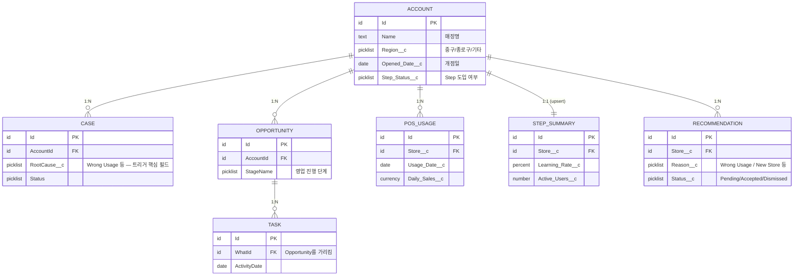

# 06_OBJECT_ERD — Object 간 Relationship

> 이 문서는 Object 간 관계를 **정형 ERD**로 정의합니다. 같은 관계를 비즈니스 의미 중심으로 설명한
> `04_DATA_MODEL.md` §2(Domain Model)와 내용은 같고 관점만 다릅니다 — 관계가 바뀌면 두 문서를 함께 고칩니다.
> Field 상세는 `04_DATA_MODEL.md`가 유일한 진실입니다.

> **처음 보는 용어?**
>
> | 용어 | 설명 |
> |---|---|
> | Object | 데이터를 저장하는 표(테이블)에 해당하는 Salesforce 용어. Account처럼 Salesforce가 기본 제공하는 **Standard Object**와, 우리가 새로 만드는 **Custom Object**(이름 끝에 `__c`가 붙는다, 예: `Recommendation__c`)가 있다. |
> | Record | Object의 데이터 한 건. 표(Object)의 "행" 하나에 해당한다. 예: 특정 매장 1곳 = Account Object의 Record 1개. |
> | Lookup | 한 Record가 다른 Record를 가리키는 관계 필드. 예: Case의 `AccountId`는 "이 CS 문의가 어느 매장 것인지" 가리킨다 — 다른 시스템의 외래 키(FK)와 같은 개념이다. |
> | PK / FK | PK(Primary Key)는 Record를 유일하게 구별하는 값(Salesforce에서는 항상 `Id`). FK(Foreign Key)는 다른 Object의 PK를 가리키는 값 — Salesforce에서는 Lookup 필드가 이 역할을 한다. |
> | ERD | Entity-Relationship Diagram. "어떤 Object가 어떤 Object와 어떻게 연결되는가"를 그림으로 표현한 것 — 이 문서의 주제. |

---

## 1. Object 목록과 설명

Salesforce 경험이 없어도 이 표만 보면 "이게 뭐고, 언제 생기고, 누가 쓰고, 왜 있는지" 알 수 있도록 정리했다.

### Store (`Account`, Business Object)

실제 매장 1곳을 의미한다. 모든 데이터는 Store(Account)를 중심으로 연결된다 — 이 프로젝트의 모든
Object가 결국 "어느 매장 이야기인가"로 귀결되는 이유다.

- **언제 생성:** Tongss Place 매장 마스터에서 최초 적재(더미 데이터는 아론이 생성 — `data/SAMPLE_DATA.md`), 이후 신규 개점 시 추가된다.
- **누가 사용:** 박세일즈가 가장 많이 조회하는 핵심 데이터. 승우(Admin Lead)가 스키마를 관리한다.
- **왜 존재:** Customer 360 전체의 중심 허브이기 때문 — `04_DATA_MODEL.md` §2 참조.

### CS Ticket (`Case`, Business Object)

고객 문의 또는 장애 접수 1건이다. CS 상담원이 생성하며, Flow가 Recommendation 생성 여부를 판단하는
핵심 데이터다.

- **언제 생성:** CS 상담원이 문의를 접수할 때마다 하나씩 생성한다.
- **누가 사용:** CS 상담원(생성), Flow(반복 조건 판정 — `07_PROCESS_DIAGRAM.md`).
- **왜 존재:** `RootCause__c`(문의 원인)가 "Wrong Usage" 조건으로 최근 3개월 내 2회 이상 쌓이면
  Cross-sell 트리거의 핵심 신호가 되기 때문 — `CLAUDE.md`.

### Sales Activity (`Opportunity`, Business Object)

매장에 대한 영업 활동/거래 진행 상황 1건이다. 박세일즈가 리드를 실제 영업으로 전환할 때 생성한다.

- **언제 생성:** 박세일즈가 Recommendation을 보고 실제 영업을 시작할 때(주로 수동 생성).
- **누가 사용:** 박세일즈(생성·진행 단계 변경).
- **왜 존재:** 영업 활동의 진행 단계(Stage: Prospecting~Closed)를 추적하기 위해.

### POS Usage (`POS_Usage__c`, Business Object)

매장의 하루치 POS 매출/사용 지표다. 외부 POS 시스템에서 매일 배치로 들어온다.

- **언제 생성:** 매일 1건씩, 전일자 마감 지표를 기준으로 자동 생성된다.
- **누가 사용:** 시스템이 자동으로 만들고(사람이 직접 입력하지 않음), 박세일즈가 조회한다.
- **왜 존재:** 매장의 운영 상태(매출 변화, 결제 오조작 정황 등)를 영업이 참고할 근거로 쓰기 위해.

### Step Summary (`Step_Summary__c`, Business Object)

Tongss Step 앱의 활용 현황 요약이다. Tongss Solution(외부 시스템)에서 요약값만 들어온다.

- **언제 생성:** Tongss Solution과 동기화될 때마다 갱신된다(매장당 최신 1건만 유지, upsert).
- **누가 사용:** 시스템이 자동으로 만들고, 박세일즈·승우가 조회한다.
- **왜 존재:** "이 매장이 Step을 잘 쓰고 있는지" 결과만 필요하고, 앱 내부 동작까지는 알 필요 없다는
  프로젝트 철학 때문 — `04_DATA_MODEL.md` §1.

### Recommendation (`Recommendation__c`, Business Object)

Flow가 자동 생성하는 영업 추천 데이터다. **Agentforce가 생성하는 것이 아니라, Flow가 만든 데이터를
Agentforce가 설명한다** — `05_SYSTEM_ARCHITECTURE.md` §2·§3.5.

- **언제 생성:** 반복 조건(Wrong Usage 2회 이상, 개점 3개월 이내 신규 매장 등)이 충족되면 Flow가 자동 생성한다.
- **누가 사용:** Flow(생성), Agentforce(설명), 박세일즈(확인·처리 — Pending/Accepted/Dismissed).
- **왜 존재:** "오늘 누구에게 연락해야 하는지"를 데이터 근거와 함께 좁혀주기 위해 — 이 프로젝트의
  한 줄 목표 그 자체다(`CLAUDE.md`).

### Follow-up (`Task`, Supporting Standard Object)

영업 활동 이후 해야 하는 후속 일정이다. **Business Object가 아니라 Salesforce 표준 Task를 그대로
사용한다** — 새 커스텀 오브젝트를 만들지 않았다.

- **언제 생성:** 박세일즈가 방문 후 Opportunity의 진행 단계(Stage)를 바꾸면 Flow가 자동 생성한다.
- **누가 사용:** Flow(생성), 박세일즈(확인·완료 처리).
- **왜 존재:** 표준 오브젝트로 충분히 표현되는 개념에 새 오브젝트를 만들지 않는다는 "Standard Object
  우선" 원칙 때문 — `04_DATA_MODEL.md` §6.

> Business Object 6개는 `CLAUDE.md`의 매핑 표와 1:1 대응한다. Follow-up(Task)은 그 표에 없다 — 새
> Business Object가 아니라 Opportunity를 보조하는 표준 오브젝트이기 때문이다(`04_DATA_MODEL.md` §6).

---

## 2. ERD — 전체 관계 한눈에 보기

> 위 다이어그램의 `ACCOUNT`/`CASE`/`OPPORTUNITY`/`POS_USAGE`/`STEP_SUMMARY`/`RECOMMENDATION`/`TASK`는
> 읽기 쉽게 붙인 이름이다. 실제 Salesforce API 이름(`POS_Usage__c` 등 정확한 표기)과 전체 필드 목록은
> `04_DATA_MODEL.md`가 유일한 진실이다.

---

## 3. Relationship 목록

| # | From | To | Lookup 필드 | Cardinality | 관계 성격 |
|---|---|---|---|---|---|
| R1 | `Case` | `Account` | `Case.AccountId` | N : 1 | 표준 Lookup (Case는 반드시 1개 Account에 속함) |
| R2 | `Opportunity` | `Account` | `Opportunity.AccountId` | N : 1 | 표준 Lookup |
| R3 | `POS_Usage__c` | `Account` | `POS_Usage__c.Store__c` | N : 1 | 커스텀 Lookup |
| R4 | `Step_Summary__c` | `Account` | `Step_Summary__c.Store__c` | 1 : 1 (운영 규칙상 매장당 최신 1건만 유지) | 커스텀 Lookup — DB 레벨 강제 아님, upsert 프로세스로 보장(`07_PROCESS_DIAGRAM.md`) |
| R5 | `Recommendation__c` | `Account` | `Recommendation__c.Store__c` | N : 1 | 커스텀 Lookup |
| R6 | `Task` | `Opportunity` | `Task.WhatId` | N : 1 | 표준 Lookup(ActivityRelation, WhatId) |

> `Recommendation__c`는 `Case`나 `Opportunity`를 직접 참조하지 않는다. Recommendation은 "Store 단위 판단
> 결과"이지 특정 Case/Opportunity에 종속된 자식이 아니기 때문이다 — 어떤 Case들이 근거였는지는 반복 조건
> 판정 시점의 조회 결과일 뿐, 영구적인 FK 관계로 저장하지 않는다(`07_PROCESS_DIAGRAM.md` Flow 설계 참조).

---

## 4. Cardinality 상세

| 관계 | 표기 | 의미 |
|---|---|---|
| Store — CS Ticket | 1 : N | 매장 하나가 여러 CS 문의를 가질 수 있다. CS 문의는 반드시 매장 하나에 속한다. |
| Store — Sales Activity | 1 : N | 매장 하나에 대해 여러 영업 활동(단계별)이 있을 수 있다. |
| Store — POS Usage | 1 : N | 매장 하나가 매일 1건씩 POS 지표를 쌓는다(운영 규칙, DB 강제 아님). |
| Store — Step Summary | 1 : 1 | 매장 하나당 "현재" 요약 1건만 유지(upsert). 이력이 아니라 최신 상태. |
| Store — Recommendation | 1 : N | 반복 조건이 다시 충족될 때마다 새 추천이 쌓인다. 과거 추천은 덮어쓰지 않는다. |
| Sales Activity — Follow-up | 1 : N | 하나의 영업 활동에 여러 후속 조치(Task)가 있을 수 있다. |

---

## 5. Relationship 설명

- **Account가 유일한 허브다.** `Case`, `Opportunity`, `POS_Usage__c`, `Step_Summary__c`,
  `Recommendation__c` 모두 Account를 직접 참조하며, 이 오브젝트들끼리 서로를 직접 참조하지 않는다
  (`Task`→`Opportunity` 제외). 이는 "Customer 360 중심" 철학을 스키마 레벨에서 강제하는 설계다 —
  어떤 오브젝트를 보더라도 항상 "어느 매장 이야기인가"가 1-hop 안에 있다.
- **Task(Follow-up)만 Account를 직접 참조하지 않는다.** Follow-up은 "어떤 영업 활동의 후속 조치인가"가
  본질이라 `Opportunity`를 통해 Account에 연결된다(2-hop). `07_PROCESS_DIAGRAM.md`의 "Sales Visit →
  Opportunity Update → Follow-up 생성" 흐름과 일치한다.
- **Step Summary의 1:1은 DB 제약이 아니라 운영 규칙이다.** Salesforce Lookup 자체는 N:1을 막지 않으므로,
  upsert 시 기존 레코드를 찾아 갱신하는 로직(Flow 또는 Apex)이 1:1을 보장해야 한다 — 상세는
  `07_PROCESS_DIAGRAM.md`.
- **Recommendation은 Case/Opportunity의 자식이 아니다.** 여러 Case가 근거가 되어 하나의
  Recommendation이 생기지만, 이는 생성 시점의 계산 결과이지 지속되는 FK 관계가 아니다. 근거를 다시
  보고 싶으면 Store 기준으로 관련 Case를 다시 조회한다(`08_SCREEN_SPEC.md`의 Store Record Page 참조).

---

## 6. 이 문서를 쓸 때 기억할 것

- 이 문서는 관계(누가 누구를 참조하는가)만 다룬다. 필드 목록·타입은 `04_DATA_MODEL.md`를 본다.
- 새 Lookup 관계가 필요해지면, 먼저 Account를 거쳐 표현할 수 없는지 검토한다(허브 구조를 깨지 않기 위해).
- 관계가 바뀌면(예: Recommendation이 Case를 직접 참조하게 되는 등) `04_DATA_MODEL.md` §2와 이 문서를
  함께 고치고 `10_DECISIONS.md`에 이유를 남긴다.

---

## Related Documents

- [`04_DATA_MODEL.md`](./04_DATA_MODEL.md) — Object/Field의 유일한 진실
- [`05_SYSTEM_ARCHITECTURE.md`](./05_SYSTEM_ARCHITECTURE.md) — 이 Object들이 시스템 안에서 어떻게 움직이는지
- [`07_PROCESS_DIAGRAM.md`](./07_PROCESS_DIAGRAM.md) — Record가 실제로 언제, 어떤 자동화로 생성되는지
- [`08_SCREEN_SPEC.md`](./08_SCREEN_SPEC.md) — 이 Object들이 어떤 화면에 나타나는지
- [`data/SAMPLE_DATA.md`](./data/SAMPLE_DATA.md) — 이 Object들의 실제 예시 데이터
