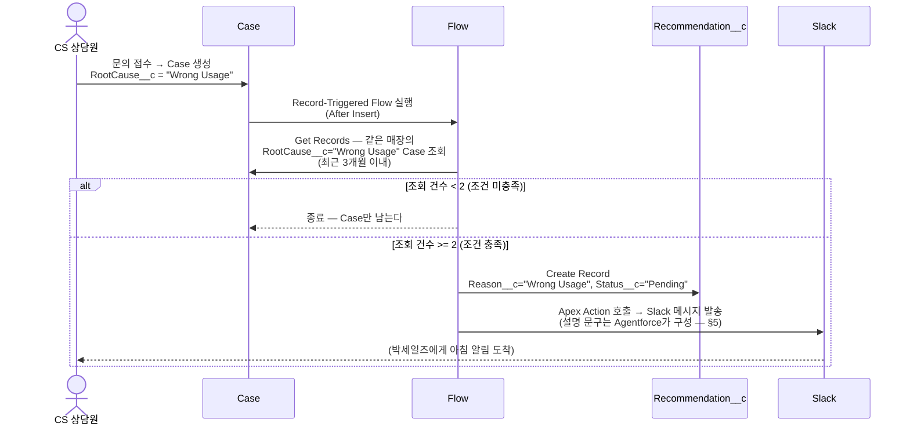
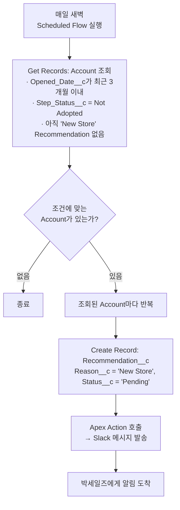
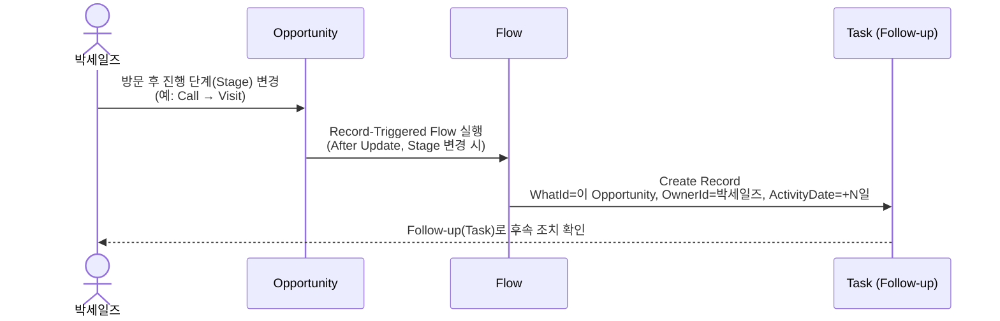

# 07_PROCESS_DIAGRAM — 데이터가 어떻게 움직이는가

> 이 문서는 Business Process(자동화 포함)를 다룹니다. 하루 일과 관점의 Before/After는 `02_USER_FLOW.md`,
> Object/Field는 `04_DATA_MODEL.md`, 시스템 간 연동은 `05_SYSTEM_ARCHITECTURE.md`, Object 관계는
> `06_OBJECT_ERD.md`를 참조합니다. 이 문서는 그 관계가 **언제, 어떤 자동화로** 실제 레코드가 되는지를 다룹니다.

> **처음 보는 용어?**
>
> | 용어 | 설명 |
> |---|---|
> | Record-Triggered Flow | "레코드가 생성/수정될 때" 자동으로 실행되는 Flow. 예: Case가 새로 생기면 바로 실행. |
> | Scheduled Flow | 정해진 시간에 주기적으로 실행되는 Flow(예: 매일 새벽 1회). 특정 이벤트가 아니라 시간이 트리거다. |
> | Get Records / Create Records | Flow 안에서 쓰는 동작 블록. Get Records는 조건에 맞는 기존 레코드를 "조회", Create Records는 새 레코드를 "생성"한다. |
> | Decision | Flow 안에서 조건에 따라 흐름을 나누는 분기점(다이어그램의 `alt`/`else`에 해당). |
> | Apex Action | Flow에서 호출하는 Apex(코드) 조각. Flow가 직접 하기 어려운 일(외부 시스템 호출 등)을 대신 처리한다. |

---

## 1. 프로세스 1 — CS 반복 문의 → Recommendation → Slack

가장 핵심적인 프로세스다. `CLAUDE.md`의 Cross-sell 트리거(반복 조건)가 여기서 구현된다.

**Flow/Apex 경계:** Case 생성부터 Recommendation 생성까지는 전부 **Flow**(Record-Triggered Flow, Get
Records, Decision, Create Records). Slack 발송만 **Apex**(Invocable Apex Action, Flow가 호출) —
`05_SYSTEM_ARCHITECTURE.md` §5.

---

## 2. 프로세스 2 — 신규 매장 → Recommendation → Slack

`CLAUDE.md`의 반복 조건 중 두 번째 경로("개점 3개월 이내 신규 매장")다. 프로세스 1과 달리 트리거가
되는 "사건"이 없다 — 개점일은 이미 지난 날짜이고, 시간이 지나면서 조건을 충족하게 된다. 그래서
Record-Triggered가 아니라 **Scheduled Flow**로 매일 점검한다.

**Flow/Apex 경계:** 조건 점검·Recommendation 생성은 **Flow**(Scheduled-Triggered). Slack 발송은 프로세스
1과 동일하게 **Apex**.

**"아직 Recommendation이 없음" 조건이 왜 필요한가:** 이 조건이 없으면 같은 매장에 대해 매일 새
Recommendation이 쌓인다. 신규 매장 조건은 "한 번 알려주면 충분한" 성격이라, 이미 "New Store"
Recommendation이 있으면 다시 만들지 않는다. Wrong Usage(프로세스 1)는 반대로 새 Case가 생길 때마다
다시 판정하는 것이 맞다 — 반복이 계속되고 있다는 신호 자체가 값어치가 있기 때문이다.

---

## 3. 프로세스 3 — Sales Visit → Opportunity Update → Follow-up 생성

박세일즈가 Recommendation을 보고 방문한 이후의 흐름이다.

**Flow/Apex 경계:** 전부 **Flow**(Record-Triggered Flow on Opportunity, After Update). 외부 연동이나
복잡한 계산이 없어 Apex가 필요 없다.

**Recommendation과의 관계:** 박세일즈가 Recommendation을 근거로 Opportunity를 만들거나 진행시켰다면,
해당 Recommendation의 `Status__c`를 "Accepted"로 갱신하는 것은 박세일즈의 수동 조작(또는 Opportunity
생성 시 함께 처리하는 Flow)이다 — Recommendation은 Opportunity를 직접 참조하지 않으므로(`06_OBJECT_ERD.md`
§3) 자동으로 연결되지 않는다.

---

## 4. Automation Flow 목록 (요약)

| Flow/Apex 이름(제안) | 유형 | 트리거 | 하는 일 | 관련 프로세스 |
|---|---|---|---|---|
| `Case_AfterInsert_CheckWrongUsageRepeat` | Record-Triggered Flow | Case 생성(After Insert) | Wrong Usage 반복 체크 → Recommendation 생성 | 프로세스 1 |
| `Recommendation_AfterInsert_NotifySlack` (Apex Action) | Invocable Apex | Flow에서 호출 | Slack 메시지 발송 | 프로세스 1, 2 |
| `Scheduled_CheckNewStore` | Scheduled Flow(일 1회) | 시간 기반 | 개점 3개월 이내 신규 매장 조회 → Recommendation 생성 | 프로세스 2 |
| `Opportunity_AfterUpdate_CreateFollowup` | Record-Triggered Flow | Opportunity StageName 변경(After Update) | Follow-up(Task) 생성 | 프로세스 3 |
| `Step_Summary_Upsert` (Apex, 배치/REST) | Apex | Tongss Solution Inbound 수신 | `Step_Summary__c` upsert(1:1 유지) | `05_SYSTEM_ARCHITECTURE.md` §3.3 |

**Flow와 Apex의 역할 구분 원칙(재확인 — `03_PROJECT_GUIDE.md` §3.1, `05_SYSTEM_ARCHITECTURE.md` §5):**

- **Flow** = Org 내부 레코드 간 로직 전부 (조건 판정, 조회, 레코드 생성/갱신)
- **Apex** = 외부 시스템과의 통신이 필요한 지점만 (Slack Outbound, Tongss Solution Inbound 수신)

---

## 5. Recommendation__c 생성 이후 — Agentforce의 역할

위 프로세스 1·2에서 `Recommendation__c`가 생성되는 순간까지는 전부 Flow의 일이다. 그 다음 단계
("Apex Action 호출 → Slack 메시지 발송")에서 Apex가 보내는 메시지 문구는 **Agentforce가 Customer 360과
`Recommendation__c` 데이터를 읽어 구성한 자연어 설명**이다 — Apex는 그 문구를 Slack으로 전송하는 역할만
한다. 즉 "무엇을 보여줄지 판단(생성)"은 Flow, "그 결과를 사람이 이해할 말로 풀기"는 Agentforce, "실제
전송"은 Apex로 셋이 나뉜다. 시스템 레벨의 상세는 `05_SYSTEM_ARCHITECTURE.md` §2·§3.5 참조.

박세일즈는 Slack으로 받은 메시지뿐 아니라, Salesforce 안에서 Agentforce에게 직접 자연어로 물어볼 수도
있다("이 매장 왜 추천됐어?", "중구에서 Wrong Usage 반복 매장 몇 개야?") — 이때도 Agentforce는
`Recommendation__c`를 새로 만들지 않고 이미 있는 레코드를 조회해서 답한다.

---

## 6. 이 문서를 쓸 때 기억할 것

- 새 자동화가 필요해지면 먼저 Flow로 표현되는지 검토하고, 외부 연동이 없다면 Apex를 쓰지 않는다.
- Recommendation 생성 조건(§1, §2)이 바뀌면 `CLAUDE.md`의 반복 조건 정의와 반드시 같이 맞춘다 — 이
  문서가 `CLAUDE.md`보다 더 세부적이지만, 근거가 되는 조건 자체는 `CLAUDE.md`가 원문이다.
- Flow 이름(§4)은 제안이며 실제 Org 구현 시 승우(Admin Lead)가 팀 네이밍 컨벤션에 맞게 확정한다.
- `Recommendation__c`를 만드는 주체는 항상 Flow다. Agentforce가 이 오브젝트를 생성한다고 서술하지
  않는다 — Agentforce는 읽기 전용 소비자다(§5, `05_SYSTEM_ARCHITECTURE.md` §3.5).

---

## Related Documents

- [`02_USER_FLOW.md`](./02_USER_FLOW.md) — 이 프로세스가 박세일즈의 하루에서 어떻게 보이는지
- [`04_DATA_MODEL.md`](./04_DATA_MODEL.md) — 여기 나오는 Object/Field의 유일한 진실
- [`05_SYSTEM_ARCHITECTURE.md`](./05_SYSTEM_ARCHITECTURE.md) — Flow/Apex/Agentforce의 시스템 레벨 역할 구분
- [`06_OBJECT_ERD.md`](./06_OBJECT_ERD.md) — 여기 나오는 Object들의 관계
- [`data/SAMPLE_DATA.md`](./data/SAMPLE_DATA.md) — 이 프로세스를 실제로 재현하는 예시 데이터(함부기 시나리오)
