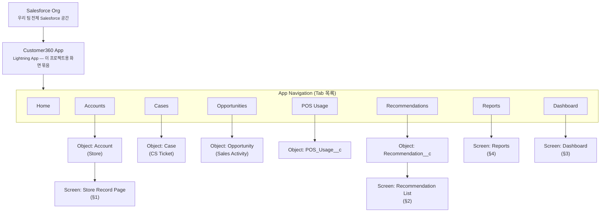

# 08_SCREEN_SPEC — 화면 및 Lightning Page 설계

> Lightning Experience 기준. 이 문서는 화면 단위 설계만 다룹니다. Object/Field는 `04_DATA_MODEL.md`,
> 화면에 데이터가 채워지는 자동화는 `07_PROCESS_DIAGRAM.md`를 참조합니다. 페르소나(박세일즈)의 하루
> 관점 사용 맥락은 `02_USER_FLOW.md`를 참조합니다.
>
> 구현 방식은 `03_PROJECT_GUIDE.md` §3.2를 따른다 — Customer 360 Record Page는 Lightning App Builder +
> LWC(Admin + Developer 공동), 나머지 화면은 최대한 표준 Salesforce 기능(List View, Report, Dashboard)으로 구성한다.
>
> **Tongss Step MVP 화면은 이 문서의 대상이 아니다.** Tongss Step MVP(체크리스트·직원 관리 등, Sara
> 구현)는 Salesforce Lightning Page가 아니라 Salesforce Org 밖의 별도 앱이다 — 그 화면 설계는
> `00_PRODUCT_GUIDE.md` §3.5·§4.1이 다룬다. 이 문서는 그 앱이 만들어낸 결과(Step Summary)가 Salesforce
> 화면에 어떻게 나타나는지만 다룬다(§1의 "Step Summary" Component).

> **처음 보는 용어?**
>
> | 용어 | 설명 |
> |---|---|
> | Lightning Page(Record Page) | 특정 Object의 레코드 한 건을 보여주는 화면 레이아웃. Lightning App Builder로 어떤 Component를 어디에 배치할지 조립한다. |
> | Related List | 레코드 페이지에서 "이 레코드와 연결된 다른 Object의 레코드 목록"을 보여주는 영역. 예: Account 페이지의 Case 목록. |
> | List View | 특정 Object의 여러 레코드를 조건(필터)에 맞춰 목록으로 보여주는 표준 화면. |
> | Highlights Panel | 레코드 페이지 맨 위에 핵심 정보 몇 개를 요약해서 보여주는 표준 영역. |
> | Quick Action | 레코드 페이지에서 버튼 클릭 한 번으로 자주 하는 작업(새 레코드 생성, 상태 변경 등)을 처리하는 기능. |
> | LWC | Lightning Web Component — Salesforce의 커스텀 화면 부품 기술. 표준 Component로 안 되는 화면만 직접 만든다. |

---

## 1. Store Record Page

### 목적
박세일즈가 Recommendation을 받고 특정 매장을 클릭했을 때, "왜 이 매장인가"에 대한 근거를 한 화면에서
확인한다 — Epic 2(고객 정보 통합 조회), `01_PERSONAS.md`의 "이 사람을 위해 지킬 것"(근거 없는 추천은
신뢰하지 않는다).

### 사용자
박세일즈 역할(영업 담당자). 부가적으로 혜준(QA)이 QA 목적으로 조회.

### Component 구성

| Component | 내용 |
|---|---|
| Account Details | 표준 Highlights Panel — Store Name, Region, Industry, Step Status |
| POS Usage | 최근 POS 지표 요약(LWC 또는 Related List) — Daily/Monthly Sales, Order/Refund Count 추이 |
| Case | 관련 CS Ticket Related List — RootCause, Status, CreatedDate. Wrong Usage 반복 여부를 한눈에 보이게 정렬(최신순) |
| Opportunity | 관련 Sales Activity Related List — Stage, Owner |
| Recommendation | 이 매장에 대한 Recommendation Related List(또는 LWC) — Reason, Score, Action, Status. Pending 상태 강조 |
| Step Summary | 최신 Step 활용 현황(LWC 또는 Related List) — LearningRate, ChecklistRate, ActiveUsers. Tongss Step MVP가 만들어낸 운영 데이터의 요약본이 여기 나타난다(`05_SYSTEM_ARCHITECTURE.md` §3.3) |
| Quick Actions | "새 Case 등록", "새 Sales Activity 등록", "방문 기록(Follow-up 완료 처리)" |

### 데이터 출처
`Account`(자기 자신) + Related List로 연결된 `Case`, `Opportunity`, `POS_Usage__c`,
`Step_Summary__c`, `Recommendation__c` — 전부 `Store__c`/`AccountId` Lookup 기준 조회(`06_OBJECT_ERD.md` §2).

### 관련 Object
`Account`, `Case`, `Opportunity`, `POS_Usage__c`, `Step_Summary__c`, `Recommendation__c`

### 관련 Flow
직접 연결된 Flow 없음(이 화면은 조회 중심). Quick Action으로 생성되는 레코드가 `07_PROCESS_DIAGRAM.md`의
Flow를 트리거할 수 있음(예: 새 Case 등록 → `Case_AfterInsert_CheckWrongUsageRepeat`).

### 관련 LWC
- `posUsageSummary` (POS Usage 추이 요약)
- `stepSummaryCard` (Step Summary 현황 카드)
- `recommendationList` (이 매장의 Recommendation 목록, Status 강조)

---

## 2. Recommendation List

### 목적
박세일즈가 아침에 "오늘 연락할 리드"를 확인하는 화면. Slack 알림에서 링크로 진입하거나, Salesforce 내
List View로 직접 접근한다 — `02_USER_FLOW.md` §2와 동일한 목적을 Salesforce 화면으로 구현한 것.

### 사용자
박세일즈 역할(영업 담당자)

### Component 구성

| Component | 내용 |
|---|---|
| List View (표준) | `Recommendation__c` List View — 필터: `OwnerId = 현재 사용자`, `Status__c = "Pending"`, 정렬: `Score__c` 내림차순 |
| 목록 컬럼 | Store Name(Lookup 표시), Reason, Score, Action, CreatedDate |
| Quick Action | 목록에서 바로 Status 변경(Accepted/Dismissed) |

### 데이터 출처
`Recommendation__c` (Owner=현재 사용자, Status=Pending 조건)

### 관련 Object
`Recommendation__c`, (Lookup으로) `Account`

### 관련 Flow
`Case_AfterInsert_CheckWrongUsageRepeat`, `Scheduled_CheckNewStore` — 이 목록에 나타나는 레코드를
생성하는 Flow(`07_PROCESS_DIAGRAM.md` §1, §2)

### 관련 LWC
표준 List View로 충분하면 LWC 없음. Score 기준 정렬/필터가 표준 List View로 부족할 경우
`recommendationInbox`(커스텀 LWC)로 보완 — 1차는 표준으로 시도(Declarative First, `03_PROJECT_GUIDE.md` §3.1).

---

## 3. Dashboard

### 목적
팀/관리자가 Cross-sell 트리거가 실제로 얼마나 영업 기회로 이어지는지 파악한다 — Epic 3(CS 기반 영업
기회 발굴)의 효과 측정.

### 사용자
Sara(PM), 승우(Admin Lead) — 팀 운영 관점. 박세일즈 본인 화면(Recommendation List)과는 목적이 다르다.

### Component 구성

| Component | 내용 |
|---|---|
| Recommendation 현황 | Status별(Pending/Accepted/Dismissed) 건수 |
| Recommendation → Opportunity 전환율 | Accepted 처리된 Recommendation 대비 실제 Opportunity 생성 비율 |
| Wrong Usage 반복 매장 수 | 최근 3개월 내 Wrong Usage 2회 이상 매장 수 추이 |
| Sales Activity Stage 분포 | Opportunity Stage별 건수(Pipeline 현황) |

### 데이터 출처
§4의 Report들을 소스로 하는 Dashboard(Salesforce 표준 Dashboard 기능)

### 관련 Object
`Recommendation__c`, `Opportunity`, `Case`

### 관련 Flow
없음(Dashboard는 조회 전용, 자동화 트리거하지 않음)

### 관련 LWC
없음(표준 Dashboard 컴포넌트로 구성)

---

## 4. Reports

### 목적
Dashboard(§3)의 소스 데이터를 제공하고, 필요 시 개별적으로 상세 데이터를 조회한다.

### 사용자
Sara(PM), 승우(Admin Lead), 혜준(QA — 리포트 자체를 관리)

### Component 구성 (Report 목록)

| Report 이름(제안) | 대상 Object | 내용 |
|---|---|---|
| Recommendation Status Summary | `Recommendation__c` | Status/Reason별 건수 |
| Recommendation Conversion | `Recommendation__c` + `Opportunity` | Accepted → Opportunity 생성 여부 |
| Wrong Usage Repeat Stores | `Case` | Store별 최근 3개월 RootCause="Wrong Usage" 건수 |
| Opportunity Pipeline by Stage | `Opportunity` | Stage별 건수/비중 |

### 데이터 출처
`Recommendation__c`, `Opportunity`, `Case` (표준 Report Builder, Cross Object Report 활용)

### 관련 Object
`Recommendation__c`, `Opportunity`, `Case`, (간접) `Account`

### 관련 Flow
없음

### 관련 LWC
없음(표준 Report Builder로 구성 — 혜준 담당, `03_PROJECT_GUIDE.md` §2)

---

## 5. 이 문서를 쓸 때 기억할 것

- 새 화면이 필요해지면 먼저 표준 Salesforce 화면(List View/Report/Dashboard/Record Page)으로 가능한지
  검토하고, LWC는 표준으로 표현 안 되는 부분에만 쓴다 — Declarative First 원칙(`03_PROJECT_GUIDE.md` §3.1).
- 각 화면 스펙에 없는 Component/Object를 임의로 추가하지 않는다. 필요해지면 이 문서를 먼저 고친다.
- 화면 이름(LWC 이름 포함)은 제안이며, 실제 구현 시 은영(Developer Lead)이 팀 컨벤션에 맞게 확정한다.

---

## 6. Appendix — Customer360 App Navigation

이 문서의 §1~§4는 화면 하나하나를 따로 설명했다. 이 Appendix는 "그 화면들이 실제로 Salesforce 안
어디에, 어떤 순서로 놓여 있는가"를 처음 보는 사람 기준으로 정리한다.

> **처음 보는 용어?**
>
> | 용어 | 설명 |
> |---|---|
> | Salesforce Org | 우리 팀이 쓰는 Salesforce 공간 전체 — 모든 App/Object/데이터가 이 안에 들어있다. |
> | App(Lightning App) | Org 안에서 특정 목적(여기서는 Customer 360 운영)을 위해 관련 Tab을 모아놓은 화면 묶음. 하나의 Org 안에 여러 App이 있을 수 있다. |
> | Tab | App 상단에 나열된 메뉴 하나. 클릭하면 그 Tab에 연결된 Object의 목록 화면(List View)이 열린다. |
> | App Navigation | 어떤 Tab들이 어떤 순서로 App에 배치되는지에 대한 설계. |

### 6.1 전체 구조 — Org → App → Object → Screen

Salesforce를 처음 보면 "이 화면이 대체 어디에 있는 화면인지" 감이 안 잡히기 쉽다. 아래 4단계만
기억하면 된다.



**읽는 법:** Org(가장 큰 공간) 안에 Customer360 App(우리가 쓰는 화면 묶음)이 있고, 그 App을 열면
위쪽에 Tab들이 나란히 보인다. Tab 하나를 클릭하면 그 Tab에 연결된 Object의 목록이 열리고, 그 목록에서
레코드 하나를 클릭하면 이 문서 §1~§4에서 설명한 화면(Screen)이 나온다.

### 6.2 Tab 목록

App 상단에 이 순서로 Tab이 나열된다.

```
Home → Accounts → Cases → Opportunities → POS Usage → Recommendations → Reports → Dashboard
```

### 6.3 Tab별 상세

| Tab | Object | Owner | Main User | Purpose |
|---|---|---|---|---|
| Home | 없음(표준 홈 화면) | 혜준 | 전체 | 로그인 후 첫 화면. 알림·최근 항목을 확인하는 시작점 |
| Accounts | `Account`(Store) | 승우 | 박세일즈 | 담당 매장 목록을 조회·검색한다 |
| Cases | `Case`(CS Ticket) | 승우 | CS 상담원 | CS 문의를 접수·처리한다(Epic 3의 시작점) |
| Opportunities | `Opportunity`(Sales Activity) | 승우 | 박세일즈 | 영업 활동의 진행 단계(Stage)를 관리한다 |
| POS Usage | `POS_Usage__c` | 승우 | 박세일즈 | 매장별 POS 지표(매출·주문·환불)를 조회한다 |
| Recommendations | `Recommendation__c` | 승우(Flow가 생성) | 박세일즈 | "오늘 연락할 리드"(Pending 목록)를 확인한다 — §2 |
| Reports | 여러 Object(Cross Object) | 혜준 | Sara·승우·혜준 | Recommendation 전환율 등 지표를 조회한다 — §4 |
| Dashboard | Report가 소스 | 혜준 | Sara·승우 | 전체 현황을 한 화면에서 파악한다 — §3 |

> **Step Summary는 왜 Tab이 없는가?** `Step_Summary__c`는 매장별로 최신 1건만 있는 요약 데이터라,
> 목록을 따로 조회할 일이 거의 없다. 그래서 별도 Tab 없이 Store Record Page(§1) 안의 Component로만
> 나타난다 — Object가 있다고 항상 Tab이 있는 것은 아니다.

### 6.4 이 Appendix가 말하는 것

이 4단계(Org → App → Object → Screen)는 이 문서 전체의 압축본이다. §1~§4가 "각 화면 안에 무엇이
있는가"를 다뤘다면, 이 Appendix는 "그 화면에 어떻게 도달하는가"를 다룬다. 새 화면이 필요해지면 먼저
이 4단계 중 어디에 들어갈지(새 Tab이 필요한지, 기존 화면의 Component로 충분한지)를 §5의 원칙에 따라
검토한다.

---

## Related Documents

- [`04_DATA_MODEL.md`](./04_DATA_MODEL.md) — 각 화면에 나오는 Object/Field의 유일한 진실
- [`06_OBJECT_ERD.md`](./06_OBJECT_ERD.md) — Related List가 어떤 Lookup 관계를 따라 표시되는지
- [`07_PROCESS_DIAGRAM.md`](./07_PROCESS_DIAGRAM.md) — Quick Action이 트리거하는 Flow 자동화
- [`02_USER_FLOW.md`](./02_USER_FLOW.md) — 박세일즈가 이 화면들을 실제로 언제 보는지(하루 흐름)
- [`data/SAMPLE_DATA.md`](./data/SAMPLE_DATA.md) — 이 화면을 채울 예시 데이터
- [`data/DEMO_DATASETS.md`](./data/DEMO_DATASETS.md) — 이 화면들을 어떤 시나리오 순서로 시연하는지
- [`members/00_SARA.md`](./members/00_SARA.md) — Tongss Step MVP 화면(이 문서 범위 밖) 담당
