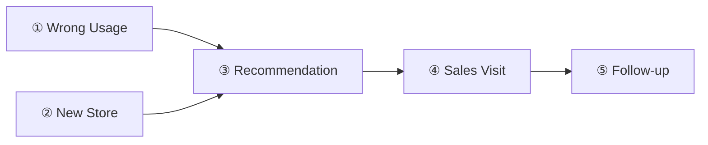

# DEMO_DATASETS — Demo Scenario 설계

> **이 문서는 CSV 예시 문서가 아니다.** 실제 CSV 값·Field·적재 순서는 `data/SAMPLE_DATA.md`가
> 유일한 진실이다. 이 문서는 **"Demo Day에 무엇을, 왜, 어떤 순서로 보여줄 것인가"**를 설계하는
> 문서다 — 데이터가 아니라 시나리오를 다룬다.
>
> 담당: 아론(Demo Lead) — `03_PROJECT_GUIDE.md` §2, `members/04_ARON.md`.

## 이 문서와 SAMPLE_DATA.md의 역할 차이

| 문서 | 다루는 것 | 질문에 답한다 |
|---|---|---|
| `data/SAMPLE_DATA.md` | 실제 CSV 값, Object별 Field, 적재 순서 | "STORE-1001의 Case 값은 정확히 뭔가?" |
| `data/DEMO_DATASETS.md`(이 문서) | 시나리오 구성, 필요한 Object, 실행되는 Flow, 기대 결과, 시연 방법 | "이 장면을 왜 보여주는가? 어떤 순서로 클릭하면 이 장면이 나오는가?" |

같은 함부기 매장(STORE-1001) 데이터를 쓰지만, SAMPLE_DATA.md는 "데이터를 어떻게 만드는지", 이
문서는 "그 데이터로 어떤 이야기를 보여주는지"를 다룬다.

---

## Scenario 목록

이 프로젝트의 핵심 Business Flow(`CLAUDE.md`, `07_PROCESS_DIAGRAM.md`)를 5개 장면으로 나눴다. 순서대로
이어보면 `data/SAMPLE_DATA.md` §6의 전체 흐름과 같아진다 — 이 문서는 그 흐름을 장면별로 쪼개서, 각
장면을 독립적으로도 시연·리허설할 수 있게 만든 것이다.

1. Wrong Usage — CS 반복 문의가 신호가 되는 장면
2. New Store — 신규 매장이 신호가 되는 장면
3. Recommendation — 신호가 리드로 전달되는 장면
4. Sales Visit — 리드가 영업 활동이 되는 장면
5. Follow-up — 영업 활동이 후속 조치로 이어지는 장면

---

## Scenario 1 — Wrong Usage (반복 CS 문의)

**사용되는 Object:** `Case`, `Account`, `Recommendation__c`

**필요한 데이터:** 함부기 매장(STORE-1001)에 RootCause__c="Wrong Usage"인 Case가 최근 3개월 내
2건(`data/SAMPLE_DATA.md` §4.2) — 신입 직원의 POS 오조작이 반복된다는 것을 보여주는 데이터.

**실행되는 Flow:** `Case_AfterInsert_CheckWrongUsageRepeat`(`07_PROCESS_DIAGRAM.md` §1)

**기대 결과:** 2번째 Wrong Usage Case가 등록되는 순간, Flow가 최근 3개월 내 같은 매장의 Wrong Usage
Case를 조회해 2건임을 확인하고 `Recommendation__c`(Reason="Wrong Usage", Status="Pending")를 자동
생성한다.

**데모 포인트:**
- 1번째 Case만 있을 때는 아무 일도 안 일어난다는 것을 먼저 보여준다("1회성이 아니라 반복 조건" —
  `CLAUDE.md`).
- 그 다음 2번째 Case를 실시간으로 등록해서, 그 즉시 Recommendation__c가 생기는 것을 보여준다 — 이
  "반복돼야 만들어진다"는 대비가 이 시나리오의 핵심 데모 포인트다.

**관련 문서:** `07_PROCESS_DIAGRAM.md` §1, `data/SAMPLE_DATA.md` §4.1·§4.2, `CLAUDE.md`(반복 조건)

---

## Scenario 2 — New Store (신규 매장)

**사용되는 Object:** `Account`, `Recommendation__c`

**필요한 데이터:** 개점일(`Opened_Date__c`)이 최근 3개월 이내인 매장(STORE-1002), `Step_Status__c`
= "Not Adopted"(`data/SAMPLE_DATA.md` §4.1).

**실행되는 Flow:** `Scheduled_CheckNewStore`(`07_PROCESS_DIAGRAM.md` §2)

**기대 결과:** 매일 새벽 실행되는 Scheduled Flow가 조건에 맞는 매장을 찾아
`Recommendation__c`(Reason="New Store")를 생성한다. 같은 매장에는 한 번만 생성된다(§2의 "아직
Recommendation이 없음" 조건).

**데모 포인트:**
- Scheduled Flow는 "매일 새벽"에 도는 것이라 실시간 대기로는 보여줄 수 없다 — Flow Builder에서
  **수동 실행(Run)**해서 즉시 결과를 만드는 방식으로 미리 준비한다.
- Wrong Usage(Scenario 1)와 대비해서 "반복은 없어도 개점 시점만으로 신호가 될 수 있다"는 것을
  강조한다 — Cross-sell 트리거의 두 번째 경로.

**관련 문서:** `07_PROCESS_DIAGRAM.md` §2, `data/SAMPLE_DATA.md` §4.1

---

## Scenario 3 — Recommendation (리드 전달)

**사용되는 Object:** `Recommendation__c`, `Account`, `Case`, `POS_Usage__c`

**필요한 데이터:** Scenario 1 또는 2에서 생성된 `Recommendation__c` 레코드.

**실행되는 Flow:** 없음 — Flow의 역할은 Scenario 1·2에서 끝났다. 이 장면은 **Apex(Slack 발송)**와
**Agentforce(설명 구성)**가 주인공이다(`07_PROCESS_DIAGRAM.md` §5).

**기대 결과:** Slack에 "오늘 연락할 리드" 메시지가 도착하고, Salesforce의 Recommendation List(§2,
`08_SCREEN_SPEC.md`)에서 Pending 상태로 조회된다. Agentforce에게 "이 매장 왜 추천됐어?"라고 물으면
근거(Case 이력 등)를 자연어로 설명한다.

**데모 포인트:**
- Slack 메시지가 도착하는 순간이 이 프로젝트의 한 줄 목표(`CLAUDE.md`)를 가장 직관적으로 보여주는
  장면이다 — 가능하면 Demo Day에서 실시간으로 화면을 띄워둔다.
- Agentforce 자연어 질의를 함께 보여주면 "Flow가 만들고 Agentforce가 설명한다"는 역할 분리
  (`05_SYSTEM_ARCHITECTURE.md` §2)가 자연스럽게 증명된다.

**관련 문서:** `07_PROCESS_DIAGRAM.md` §5, `05_SYSTEM_ARCHITECTURE.md` §3.4·§3.5, `08_SCREEN_SPEC.md` §2

---

## Scenario 4 — Sales Visit (영업 방문)

**사용되는 Object:** `Recommendation__c`, `Opportunity`

**필요한 데이터:** Scenario 3에서 확인한 Pending `Recommendation__c`.

**실행되는 Flow:** 없음 — 이 장면은 **박세일즈의 수동 조작**이 트리거다. Flow는 다음 장면
(Follow-up)에서 다시 등장한다.

**기대 결과:** 박세일즈가 Recommendation List에서 Status를 "Accepted"로 바꾸고, Store Record
Page(§1)에서 새 `Opportunity`(Stage="Call")를 만든다. 이후 실제 방문 후 Stage를 "Visit"으로 올린다.

**데모 포인트:**
- Recommendation List의 Quick Action(Status 변경)과 Store Record Page의 Quick Action(새
  Opportunity 생성)을 순서대로 보여줘서 "근거 → 판단 → 행동"이 화면 몇 번 클릭으로 이어진다는 것을
  강조한다.
- Recommendation과 Opportunity는 직접 연결(Lookup)돼 있지 않다(`06_OBJECT_ERD.md` §2) — 이건
  설계 의도이므로, 화면상 "그럼 왜 안 이어져 있나요?"라는 질문이 나올 수 있는 지점이다. 근거는
  Store Record Page에서 Case/POS Usage를 다시 조회하는 방식으로 이어진다고 설명한다.

**관련 문서:** `02_USER_FLOW.md` §2, `08_SCREEN_SPEC.md` §1·§2

---

## Scenario 5 — Follow-up (후속 조치)

**사용되는 Object:** `Opportunity`, `Task`

**필요한 데이터:** Scenario 4에서 Stage가 "Visit"으로 바뀐 `Opportunity`.

**실행되는 Flow:** `Opportunity_AfterUpdate_CreateFollowup`(`07_PROCESS_DIAGRAM.md` §3)

**기대 결과:** Opportunity의 Stage가 바뀌는 즉시 `Task`(Follow-up)가 자동 생성된다(OwnerId=박세일즈,
ActivityDate=+N일).

**데모 포인트:**
- Stage를 바꾸는 즉시 Task가 화면에 나타나는 것을 실시간으로 보여준다 — "사람이 후속 조치를 따로
  만들지 않아도 된다"는 것이 포인트.
- Task는 Business Object가 아니라 표준 Object(Supporting Standard Object, `04_DATA_MODEL.md` §6)를
  그대로 쓴 것이라는 점을 짧게 언급하면, "새 Object를 함부로 안 만든다"는 이 프로젝트의 설계 원칙이
  자연스럽게 드러난다.

**관련 문서:** `07_PROCESS_DIAGRAM.md` §3, `04_DATA_MODEL.md` §6.1

---

## 전체 시나리오 순서 (요약)

①·②는 어느 쪽으로 시작해도 되지만(둘 다 Recommendation을 만드는 경로), Demo Day에서는 함부기
매장 스토리와 바로 연결되는 **① Wrong Usage**로 시작하는 것을 권장한다 — `01_PERSONAS.md` 참조.

---

## 이 문서를 쓸 때 기억할 것

- 이 문서는 시나리오(왜·무엇을·어떤 순서로)만 다룬다. 구체적 CSV 값이 필요하면 `data/SAMPLE_DATA.md`를
  고친다 — 이 문서에 CSV 값을 옮겨 적지 않는다.
- 새 시나리오가 필요해지면 먼저 `07_PROCESS_DIAGRAM.md`에 대응하는 프로세스가 있는지 확인한다 —
  Business Logic에 없는 시나리오를 임의로 만들지 않는다.
- Task/체크리스트/진행률은 여기에 쓰지 않는다 — 시나리오 리허설 진행 상황은 GitHub Projects에서
  관리한다(`03_PROJECT_GUIDE.md` §5).

---

## Related Documents

- [`SAMPLE_DATA.md`](./SAMPLE_DATA.md) — 이 시나리오에 쓰이는 실제 CSV 값
- [`../07_PROCESS_DIAGRAM.md`](../07_PROCESS_DIAGRAM.md) — 각 시나리오가 근거하는 Flow/Apex/Agentforce 자동화
- [`../08_SCREEN_SPEC.md`](../08_SCREEN_SPEC.md) — 각 시나리오에서 시연할 화면
- [`../01_PERSONAS.md`](../01_PERSONAS.md) — 함부기 매장 스토리의 원본
- [`../members/04_ARON.md`](../members/04_ARON.md) — 이 문서를 담당하는 Demo Lead의 Weekly Guide
