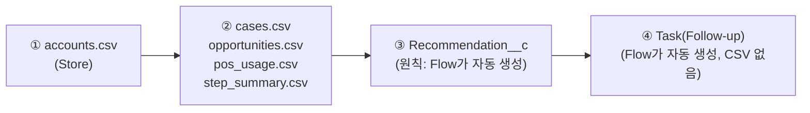
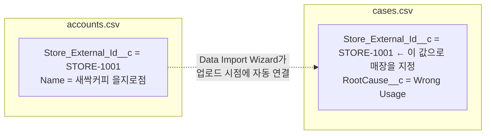
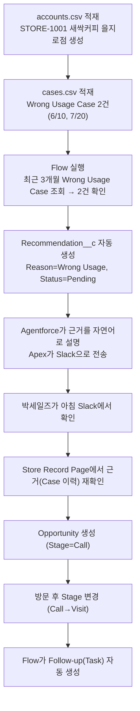

# SAMPLE_DATA — 더미 데이터 예시

> 이 문서 하나만 보고 더미 데이터를 만들 수 있도록 작성했다. Object/Field 정의는 `04_DATA_MODEL.md`가
> 유일한 진실이므로, 이 문서의 예시가 그 문서와 다르면 `04_DATA_MODEL.md`를 따른다.
>
> 담당: 아론(Demo Lead) — `03_PROJECT_GUIDE.md` §2.

> **처음 보는 용어?**
>
> | 용어 | 설명 |
> |---|---|
> | CSV | 엑셀처럼 표 형태 데이터를 콤마(,)로 구분해 저장하는 텍스트 파일 형식. Salesforce에 데이터를 대량으로 넣을 때 이 형식을 쓴다. |
> | Data Import Wizard | Salesforce 화면에서 CSV 파일을 업로드해 레코드를 대량 생성해주는 기능. 코드 없이 클릭만으로 더미 데이터를 넣을 수 있다. |
> | External ID | Salesforce Record Id(시스템이 자동으로 부여하는 값)와 별개로, 우리가 직접 정한 고유 식별자. 아직 Salesforce에 만들어지지 않은 레코드끼리 CSV에서 서로를 참조할 때 이 값을 쓴다. |

---

## 1. 왜 이 문서가 중요한가

Dummy Data는 이 프로젝트 데모의 핵심이다. 아무리 화면과 자동화(Flow)가 잘 만들어져 있어도, 데이터가
없으면 Demo Day에 보여줄 것이 없다. 특히 **함부기 매장이 Wrong Usage 반복 조건을 충족해서 실제로
Recommendation이 생기는 장면**은 이 프로젝트의 한 줄 목표를 보여주는 가장 중요한 데모 시나리오다
(`CLAUDE.md`, `01_PERSONAS.md`).

---

## 2. 데이터를 넣는 순서

Object끼리 Lookup(다른 Object를 가리키는 연결)으로 묶여 있기 때문에, **순서를 지키지 않으면 연결이
깨진다.** Account가 항상 먼저다 — 다른 모든 Object가 Account를 가리키기 때문이다(`06_OBJECT_ERD.md` §2).

- **① Store(Account)를 가장 먼저 넣는다.** 아직 아무 데이터도 없으므로 무조건 처음이다.
- **② Account를 참조하는 나머지 Object를 넣는다.** Case, Opportunity, POS Usage, Step Summary는
  순서 상관없이 서로 넣어도 되지만, Account보다는 반드시 나중이어야 한다.
- **③ Recommendation__c는 원칙적으로 사람이 CSV로 넣지 않는다.** Flow가 조건(Wrong Usage 반복, 신규
  매장 등)을 보고 자동으로 만든다(`07_PROCESS_DIAGRAM.md`). 다만 Flow가 아직 완성되지 않은 개발 초기
  단계에 화면(`08_SCREEN_SPEC.md`)만 먼저 확인하고 싶다면, §7의 예시처럼 임시로 수동 입력해도 된다 —
  이때는 "이건 Flow가 나중에 자동으로 만들 데이터를 임시로 흉내 낸 것"이라는 점을 데모 스크립트에 표시한다.
- **④ Task(Follow-up)는 CSV 파일 자체가 없다.** 박세일즈가 Opportunity 단계를 바꾸면 Flow가 그때
  자동으로 만든다(`07_PROCESS_DIAGRAM.md` §3). 미리 데이터를 넣어둘 대상이 아니다.

---

## 3. Lookup 관계는 CSV에서 어떻게 표현하는가

Case/Opportunity/POS Usage/Step Summary/Recommendation은 전부 "이 레코드가 어느 매장 것인가"를
가리키는 Lookup을 갖고 있다(`06_OBJECT_ERD.md` §3). 문제는 Account를 아직 안 만든 시점에는 Salesforce가
자동으로 부여하는 Record Id를 알 수 없다는 것이다.

그래서 Account에 **External ID**(`Store_External_Id__c`)를 미리 정해두고, 나머지 CSV들은 진짜
Salesforce Id 대신 이 External ID 값으로 "어느 매장인지" 표시한다. Data Import Wizard가 업로드 시점에
이 값을 보고 알아서 진짜 Account Id로 연결해준다 — 우리가 Salesforce Id를 미리 알아낼 필요가 없다.

---

## 4. Object별 예시 데이터

### 4.1 Store (`Account`) — `accounts.csv`

| Store_External_Id__c | Name | Industry | Region__c | Opened_Date__c | POS_Plan__c | NumberOfEmployees | Step_Status__c |
|---|---|---|---|---|---|---|---|
| STORE-1001 | MashiTa버거 을지로 본점 | 카페 | 중구 | 2023-01-15 | Standard | 4 | Not Adopted |
| STORE-1002 | 좋은식당 종로점 | 식당 | 종로구 | 2026-06-01 | Basic | 6 | Not Adopted |
| STORE-1003 | 청담미용실 중구점 | 미용 | 중구 | 2022-05-10 | Premium | 10 | Adopted |

- **STORE-1001(MashiTa버거 을지로 본점)** = 함부기(이대표)의 매장. §6 시나리오의 주인공.
- **STORE-1002**는 개점일이 최근(2026-06-01, "오늘" 2026-08-04 기준 약 2개월 전)이라 "개점 3개월 이내
  신규 매장" 조건(`CLAUDE.md`)을 보여주는 예시다 — 프로세스 2(`07_PROCESS_DIAGRAM.md` §2)를 시연할 때 쓴다.
- **STORE-1003**은 이미 Step을 도입한 매장(대조군) — Recommendation이 생기면 안 되는 경우를 보여준다.

### 4.2 CS Ticket (`Case`) — `cases.csv`

| Store_External_Id__c | Type(Category) | Status | Priority | Engineer_Visited__c | RootCause__c | CreatedDate |
|---|---|---|---|---|---|---|
| STORE-1001 | 결제 | Closed | Medium | No | Wrong Usage | 2026-06-10 |
| STORE-1001 | 단말기 | Closed | Medium | No | Wrong Usage | 2026-07-20 |
| STORE-1001 | 정산 | Closed | Low | No | POS Bug | 2026-05-05 |
| STORE-1002 | 결제 | New | Low | No | Network | 2026-07-28 |

- STORE-1001은 **최근 3개월 내 RootCause__c="Wrong Usage" Case가 2건**이다(6/10, 7/20) — 반복 조건
  충족 예시(`CLAUDE.md`, `07_PROCESS_DIAGRAM.md` §1).
- 5/5 Case는 RootCause가 "POS Bug"라 Wrong Usage 카운트에 들어가지 않는다 — 조건이 특정 RootCause 값만
  센다는 것을 보여주는 대조 예시.

### 4.3 POS Usage (`POS_Usage__c`) — `pos_usage.csv`

| Store_External_Id__c | Usage_Date__c | Daily_Sales__c | Monthly_Sales__c | Order_Count__c | Refund_Count__c | Last_POS_Login__c | POS_Version__c |
|---|---|---|---|---|---|---|---|
| STORE-1001 | 2026-08-03 | 450000 | 8200000 | 63 | 4 | 2026-08-03 21:10 | 3.2.1 |
| STORE-1001 | 2026-08-02 | 410000 | 7750000 | 58 | 2 | 2026-08-02 21:05 | 3.2.1 |

- Refund_Count__c가 상대적으로 높은 편(4건/63건)인 것도 "직원이 POS를 자주 잘못 조작한다"는
  `01_PERSONAS.md`의 함부기 페인포인트와 어울리는 값으로 골랐다 — 실제 트리거 조건(§4.2의 Case)과
  별개로, Store Record Page(`08_SCREEN_SPEC.md`)에서 보여줄 정황 데이터다.

### 4.4 Step Summary (`Step_Summary__c`) — `step_summary.csv`

Step Summary는 Tongss Step을 실제로 쓰기 시작한 매장에만 존재한다(`05_SYSTEM_ARCHITECTURE.md` §3.3).
STORE-1001·STORE-1002는 아직 Not Adopted이므로 Step Summary 레코드 자체가 없다 — "없는 것"도 정상 상태다.

| Store_External_Id__c | Learning_Rate__c | Checklist_Rate__c | Active_Users__c | Last_Sync_Date__c |
|---|---|---|---|---|
| STORE-1003 | 82 | 90 | 8 | 2026-08-01 09:00 |

### 4.5 Recommendation (`Recommendation__c`)

원칙적으로 CSV로 넣지 않는다(§2). 아래는 §4.2의 Case 2건이 반복 조건을 충족했을 때 **Flow가 만들어야
하는 결과값**을 미리 보여주는 참고용 예시다 — 화면 데모를 먼저 확인하고 싶을 때만 수동으로 흉내 낸다.

| Store_External_Id__c | Reason__c | Score__c | Action__c | Status__c | Owner |
|---|---|---|---|---|---|
| STORE-1001 | Wrong Usage | 82 | Call | Pending | 박세일즈 |

### 4.6 Sales Activity (`Opportunity`) — `opportunities.csv`

박세일즈가 위 Recommendation을 보고 실제 영업을 시작하면 생기는 데이터다. 데모 시나리오 초반에는
비워두고, 시연 중에 화면에서 직접 만들어도 된다.

| Store_External_Id__c | Owner | StageName |
|---|---|---|
| STORE-1001 | 박세일즈 | Call |

---

## 5. Import 담당 계정 값 채우기

`OwnerId`처럼 사용자를 가리키는 컬럼은 실제 Salesforce 사용자 이름(또는 이메일)로 채운다. 이 프로젝트의
Salesforce 사용자는 실제 팀원이다 — 박세일즈·이대표(함부기)는 **페르소나이지 로그인 계정이 아니다**
(`01_PERSONAS.md`). 데모에서 "박세일즈"로 표시되는 화면은 실제로는 팀원(예: 승우 또는 데모용 계정)이
그 역할을 대신 로그인해서 보여준다 — 계정 매핑은 혜준(Platform/QA Lead)이 Permission Set과 함께 정리한다.

---

## 6. 예시 시나리오 — 함부기 매장 (STORE-1001) 전체 흐름

`01_PERSONAS.md`의 이대표(함부기) 스토리를 데이터로 그대로 재현한 것이다. Demo Day에서 이 순서대로
보여주면 된다.

각 단계가 어떤 문서의 어떤 자동화에 해당하는지: B~D는 `07_PROCESS_DIAGRAM.md` §1, E는 같은 문서 §5,
F~G는 `02_USER_FLOW.md` §2, H~J는 `07_PROCESS_DIAGRAM.md` §3.

---

## 7. 이 문서를 쓸 때 기억할 것

- 예시 값(매장명, 날짜, 매출액 등)은 자유롭게 바꿔도 된다. 단, **Object/Field 이름과 Picklist 값은
  `04_DATA_MODEL.md`를 벗어나면 안 된다.**
- 새 예시 매장이 필요하면 이 문서에 추가하고, 함부기 매장(STORE-1001)은 핵심 데모 시나리오이므로
  값을 바꿀 때 `01_PERSONAS.md`의 스토리와 어긋나지 않는지 확인한다.
- "오늘 날짜" 기준으로 최근 3개월 조건을 맞춰야 하는 예시(§4.2, §4.1의 STORE-1002)는 실제 데모 날짜에
  맞게 날짜 값을 다시 계산해서 넣는다 — 날짜가 지나면 조건을 더 이상 충족하지 못할 수 있다.

---

## Related Documents

- [`../04_DATA_MODEL.md`](../04_DATA_MODEL.md) — Object/Field의 유일한 진실
- [`../06_OBJECT_ERD.md`](../06_OBJECT_ERD.md) — 여기서 쓰는 Lookup 관계의 근거
- [`../07_PROCESS_DIAGRAM.md`](../07_PROCESS_DIAGRAM.md) — 이 데이터로 어떤 자동화가 실행되는지
- [`../09_PROJECT_TREE.md`](../09_PROJECT_TREE.md) — 이 CSV 파일들이 실제로 저장되는 위치(`scripts/data/`)
- [`../01_PERSONAS.md`](../01_PERSONAS.md) — 함부기 매장 시나리오의 원본 스토리
